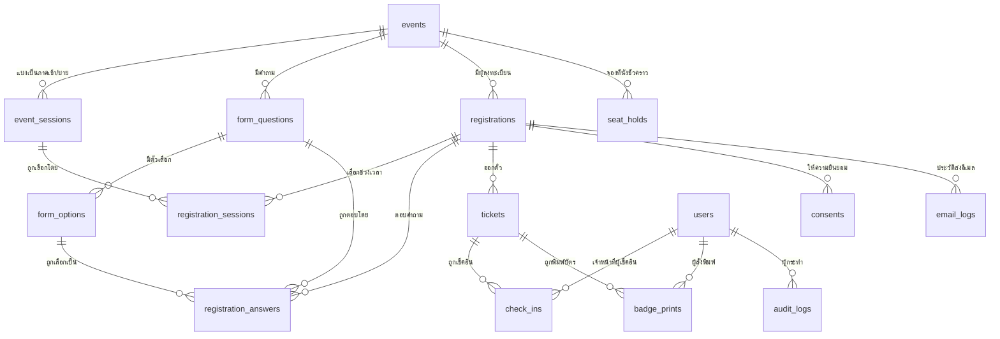

# ขั้นตอนที่ 0 — เอกสารนำเสนอกระบวนการทำงานทั้งหมด
## ระบบรับลงทะเบียนเข้าร่วมงาน (Event Registration System)

> เอกสารฉบับนี้คือส่งมอบชิ้นที่ 1 ตามข้อกำหนด "ขั้นตอนที่ 0"
> **ยังไม่มีการเขียนโค้ดใด ๆ** — รอการยืนยันจากผู้ว่าจ้างก่อนเข้าเฟสถัดไป
> จัดทำเมื่อ: 3 กันยายน 2569 · **เวอร์ชัน 2.0** — เพิ่มข้อกำหนดรอบที่ 2 จำนวน 6 ข้อ (ดูหัวข้อ **0.8**)

---

## ⚠️ ข้อจำกัดที่ต้องแจ้งก่อน (โปรดอ่านก่อนอย่างอื่น)

### 1) ผมเขียนไฟล์ลงเครื่องของคุณโดยตรงไม่ได้

พร้อมท์กำหนดให้บันทึกไฟล์ทั้งหมดไว้ที่ `C:\Users\TIKKIE\Desktop\ai project\register`
แต่ session นี้ทำงานอยู่บน **container บนคลาวด์ (Linux)** ไม่ได้รันบนเครื่อง Windows ของคุณ
จึงไม่มีทางเข้าถึงไดรฟ์ `C:` ของคุณได้ ไม่ว่าจะเปิดสิทธิ์อย่างไรก็ตาม — เป็นข้อจำกัดเชิงสถาปัตยกรรม ไม่ใช่เรื่องสิทธิ์การเข้าถึง

**วิธีแก้ที่ใช้ได้จริง:** ผมทำงานในโฟลเดอร์ของ container แล้ว push ขึ้น GitHub repo `Tikkieteddy/register`
จากนั้นคุณ clone/pull ลงเครื่องตัวเองที่ path ที่ต้องการ ผลลัพธ์เหมือนกันทุกประการ:

```powershell
cd "C:\Users\TIKKIE\Desktop\ai project"
git clone https://github.com/Tikkieteddy/register.git register
cd register
git checkout claude/event-registration-step-0-i9ulcz
```

ครั้งต่อ ๆ ไปที่ผมส่งงานเพิ่ม ให้รัน `git pull` ในโฟลเดอร์เดิม
(ถ้าคุณอยากให้ผมทำงานบนเครื่องคุณโดยตรงจริง ๆ ต้องรัน Claude Code แบบ CLI บนเครื่อง Windows ของคุณเอง ไม่ใช่ผ่านเว็บ/แอป)

### 2) ได้รับภาพอ้างอิงครบแล้ว ✅

ได้รับครบทั้ง **7 ภาพ** และปรับเอกสารฉบับนี้ให้ตรงกับภาพจริงเรียบร้อยแล้ว:

| ภาพ | เนื้อหา | ใช้ปรับส่วนไหนของเอกสาร |
|---|---|---|
| 1 | **แผนผัง workflow ทั้งระบบ** + ตัวอย่างบัตรห้อยคอจริง (SET Thailand Focus 2026) | ยืนยันหัวข้อ 0.2 · ปรับเลย์เอาต์บัตรในหัวข้อ 2.8 |
| 2 | หน้าลงทะเบียน Zipevent — stepper + การ์ดสรุปงาน + การ์ดข้อมูลผู้ลงทะเบียน + แถบสรุปขวา | ปรับหัวข้อ 1.3 |
| 3 | การ์ดตั๋ว "1 - Free" + dropdown ใช้ข้อมูลของตั๋วอื่น + helper text + **สถานะ error** | ปรับหัวข้อ 1.3 และ 1.4 |
| 4 | radio 2 คอลัมน์ · checkbox 2 คอลัมน์ · เงื่อนไข "เลือกได้ไม่เกิน 3 ข้อ" | ปรับหัวข้อ 1.3 |
| 5 | คำถามช่องทางรับข่าว · แผนเข้าร่วมวันใด · **ข้อความ PDPA + radio ยินยอม/ไม่ยินยอม** | ยืนยันคำถาม Q11 |
| 6 | **หน้า "เสร็จสิ้น" (Thank You)** + การ์ด E-Ticket | ปรับหัวข้อ 1.5 |
| 7 | **ตั๋วสำหรับพิมพ์ (Printable Ticket)** เลย์เอาต์ 2 คอลัมน์ | เพิ่มภาคผนวก A |

**สิ่งที่ยืนยันได้จากภาพแผนผัง workflow (ภาพที่ 1):**
flow ที่ผมสรุปไว้ในหัวข้อ 0.2 **ตรงกับที่คุณวางไว้ทุกขั้นตอน** —
`ผู้สนใจร่วมงาน → ลงทะเบียน → แบบฟอร์มลงทะเบียน → submit → อีเมล (มีวัน เวลา สถานที่ ตามเวลาที่เลือก + QR Code) → ส่งไปหาผู้ลงทะเบียน → วันงาน: แสดง QR ที่จุดลงทะเบียน → จนท.สแกน QR → ปริ้นชื่อติดบัตรห้อยคอ/ริสแบนด์ → หลังงาน: รีพอร์ทเป็นกราฟ`
สิ่งที่ผมเพิ่มเข้ามาเกินจากแผนผัง (การจองที่นั่ง 15 นาที · การทำงานออฟไลน์ · waitlist · audit log) เป็นข้อกำหนดที่มาจากหัวข้อ A–E ของพร้อมท์ ไม่ได้ขัดกับแผนผังของคุณ

---

## 0.1 สรุปภาพรวมระบบ

### ระบบนี้คืออะไร

ระบบเว็บแอปพลิเคชันที่ดูแลวงจรชีวิตของผู้เข้าร่วมงาน **ตั้งแต่ต้นจนจบแบบครบวงจร** ครอบคลุม 3 ช่วงเวลา:

| ช่วง | ระบบทำอะไร |
|---|---|
| **ก่อนงาน** | หน้ารายละเอียดงาน → ฟอร์มลงทะเบียนออนไลน์ → ตรวจสอบ/ตัดโควตาที่นั่ง → ส่งอีเมลยืนยันพร้อม QR Code อัตโนมัติ |
| **วันงาน** | เจ้าหน้าที่สแกน QR ผ่านมือถือ → บันทึกเช็คอิน → พิมพ์บัตรห้อยคอ/ริสแบนด์ทันที → ทำงานได้แม้เน็ตหลุด |
| **หลังงาน** | Dashboard กราฟสรุปผล → Export Excel/CSV/PDF → ข้อมูลไปใช้วางแผนงานครั้งต่อไป |

### แก้ปัญหาอะไร

| ปัญหาเดิม (ลงทะเบียนแบบกระดาษ/Google Form) | ระบบนี้แก้อย่างไร |
|---|---|
| หน้างานคิวยาว ต้องหาชื่อในกระดาษทีละแผ่น | สแกน QR เสร็จใน 1 วินาที ไม่ต้องค้นด้วยตา |
| ไม่รู้ว่าคนที่ลงทะเบียนมาจริงกี่คน (Show-up rate) | บันทึกเวลาเช็คอินทุกคน คำนวณอัตราการมาจริงอัตโนมัติ |
| ลงทะเบียนเกินจำนวนที่นั่ง เพราะนับมือไม่ทัน | ตัดโควตาแบบ transaction + row lock ปิดรับอัตโนมัติเมื่อเต็ม |
| ลงทะเบียนซ้ำด้วยอีเมลเดิม ข้อมูลรก | ตรวจอีเมลซ้ำตั้งแต่หน้าฟอร์ม |
| ต้องพิมพ์บัตรชื่อล่วงหน้าทุกคน เสียเปล่าครึ่งหนึ่ง | พิมพ์เฉพาะคนที่มาจริง ณ จุดเช็คอิน |
| ไม่รู้ว่าโปรโมทช่องทางไหนได้ผล | เก็บ "ทราบข่าวจากทางไหน" + UTM แล้วออกเป็นกราฟ |
| เก็บข้อมูลส่วนบุคคลโดยไม่มีหลักฐานความยินยอม (เสี่ยง PDPA) | เก็บ consent พร้อม timestamp + policy version + มีฟังก์ชันลบตามคำขอ |
| หน้างาน Wi-Fi ล่ม = ระบบใช้ไม่ได้เลย | PWA ทำงาน offline ได้ แล้ว sync กลับอัตโนมัติ |

### ผู้เกี่ยวข้อง (Actors)

มี **5 กลุ่ม** แบ่งเป็นผู้ใช้ที่เป็นคน 4 กลุ่ม และระบบอัตโนมัติ 1 กลุ่ม:

| # | Actor | บทบาท | สิทธิ์ที่ได้รับ |
|---|---|---|---|
| 1 | **ผู้สนใจร่วมงาน / ผู้ลงทะเบียน** | กรอกฟอร์ม รับอีเมล แสดง QR วันงาน | ไม่ต้องล็อกอิน (Guest) เข้าถึงได้เฉพาะตั๋วของตัวเองผ่าน token |
| 2 | **เจ้าหน้าที่ลงทะเบียนหน้างาน (Staff)** | สแกน QR เช็คอิน ลงทะเบียน walk-in พิมพ์บัตร | ล็อกอิน · เห็นเฉพาะข้อมูลที่จำเป็นต่อการเช็คอิน · **ห้าม export ห้ามลบ** |
| 3 | **ผู้ดูแลระบบ / ผู้จัดงาน (Admin)** | ตั้งค่างาน จัดการรายชื่อ ดู Dashboard Export ส่งอีเมลซ้ำ | ล็อกอิน + แนะนำเปิด 2FA · เข้าถึงได้ทุกอย่าง · ทุกการกระทำถูกบันทึก audit log |
| 4 | **ผู้บริหาร / ฝ่ายการตลาด** *(ทางเลือก)* | ดูรายงานอย่างเดียว | บทบาท `viewer` — เห็น Dashboard แต่เห็นข้อมูลส่วนบุคคลแบบปิดบัง (masked) |
| 5 | **ระบบอัตโนมัติ (System Jobs)** | ส่งอีเมล/retry, สร้าง QR & PDF, คืนที่นั่งที่หมดเวลาจอง, backup รายวัน, sync ข้อมูล offline | ไม่ใช่คน — ทำงานเป็น background job/queue |

> **หมายเหตุ:** หัวข้อ 0.3 จะลงรายละเอียดเฉพาะกลุ่ม 1–3 ตามที่พร้อมท์กำหนด
> ส่วนกลุ่ม 4 เป็นข้อเสนอเพิ่มของผม (ถ้าไม่ต้องการให้ตัดออกได้) และกลุ่ม 5 อธิบายไว้ในหัวข้อ 0.2

---

## 0.2 แผนผัง Workflow ทั้งหมดเป็นขั้นตอน

### ช่วงที่ 1 · ก่อนงาน (Pre-event)

| # | ขั้นตอน | ผู้ทำ | ผลลัพธ์ที่เกิดขึ้นในระบบ |
|---|---|---|---|
| 1 | สร้างงานใหม่ ใส่ชื่องาน วัน-เวลา สถานที่ โปสเตอร์ แผนที่ | Admin | สร้างเรคคอร์ดใน `events` |
| 2 | ตั้งโควตาที่นั่ง **แยกภาคเช้า / ภาคบ่าย** และกำหนดวันเปิด-ปิดรับ | Admin | สร้าง `event_sessions` 2 แถว พร้อมจำนวน `quota` |
| 3 | ตั้งค่าคำถามในฟอร์ม (ตัวเลือกอาชีพ, รายการ TNN, ช่องทางรับข่าว) | Admin | `form_questions` + `form_options` |
| 4 | ตรวจทานเนื้อหาอีเมลยืนยัน + กด "ส่งอีเมลทดสอบ" หาตัวเอง | Admin | ยืนยันว่าอีเมลไม่ตกถัง Junk ก่อนเปิดจริง |
| 5 | เปิดรับลงทะเบียน + เผยแพร่ลิงก์ผ่าน Facebook / TikTok / YouTube / TNN / อีเมลเชิญ | Admin + ฝ่ายการตลาด | ลิงก์แต่ละช่องทางแนบ UTM แยกกัน เพื่อวัดผลได้ |
| 6 | ผู้สนใจเปิดหน้ารายละเอียดงาน เห็นวัน-เวลา สถานที่ และ **จำนวนที่นั่งคงเหลือ** | ผู้ลงทะเบียน | บันทึก page view + UTM |
| 7 | กดปุ่ม "ลงทะเบียน" → ระบบ **จองที่นั่งชั่วคราว 15 นาที** | ผู้ลงทะเบียน | สร้าง `seat_holds` พร้อม `expires_at` และเริ่มนับถอยหลังบนหน้าจอ |
| 8 | กรอกข้อมูลส่วนตัว + คำถามเพิ่มเติม 3 ข้อ + ติ๊กยินยอมบันทึกภาพ + ยินยอม PDPA | ผู้ลงทะเบียน | ตรวจ validate ฝั่ง client แบบทันที (real-time) |
| 9 | กด "ลงทะเบียน" → ตรวจซ้ำฝั่งเซิร์ฟเวอร์ทั้งหมดอีกรอบ | ระบบ | ห้ามเชื่อข้อมูลจากฝั่ง client เด็ดขาด |
| 10 | ตรวจอีเมลซ้ำ + ตรวจ reCAPTCHA/honeypot + ตรวจ rate limit | ระบบ | ถ้าซ้ำ → เสนอ "ส่งตั๋วเดิมซ้ำให้" แทนการสร้างใหม่ |
| 11 | **ตัดโควตาที่นั่งภายใน transaction + row lock** | ระบบ | กัน race condition ตอนคนแย่งกันลงพร้อมกัน 300 คน |
| 12 | สร้าง `registration_code` (โค้ดสั้นอ่านง่าย) + `qr_token` (UUID v4 สุ่ม) | ระบบ | บันทึก `registrations` + `tickets` + `consents` |
| 13 | เข้าคิวงานส่งอีเมล (background queue) แล้ว **ตอบกลับผู้ใช้ทันที ไม่รอส่งอีเมลเสร็จ** | ระบบ | ผู้ใช้เห็นหน้า "เสร็จสิ้น" ภายใน < 1 วินาที |
| 14 | แสดงหน้า "เสร็จสิ้น" พร้อม E-Ticket + QR Code ขนาดใหญ่ + ปุ่มพิมพ์/ดาวน์โหลด PDF/.ics | ระบบ | ผู้ใช้ได้ตั๋วทันที **แม้อีเมลจะยังส่งไม่ถึง** |
| 15 | Worker ดึงงานจากคิว → สร้างภาพ QR → เรนเดอร์อีเมล HTML → ส่ง | System Job | บันทึก `email_logs` ทุกครั้ง |
| 16 | ถ้าส่งไม่สำเร็จ → **retry 3 ครั้งแบบ exponential backoff** แล้วแจ้งเตือน Admin | System Job | สถานะใน `email_logs` เปลี่ยนเป็น `failed` ให้ Admin เห็นและกดส่งซ้ำได้ |
| 17 | ผู้ลงทะเบียนได้รับอีเมล → เซฟ QR / เพิ่มลงปฏิทิน / พิมพ์ตั๋ว | ผู้ลงทะเบียน | — |
| 18 | ทุก 5 นาที: **คืนที่นั่งที่จองค้างเกิน 15 นาที** กลับเข้าระบบ | System Job | ลบ `seat_holds` ที่หมดอายุ + คืน `reserved_count` |
| 19 | Admin ติดตาม Dashboard รายวัน ส่งอีเมลซ้ำให้คนที่ไม่ได้รับ | Admin | — |
| 20 | **D-1 (ก่อนงาน 1 วัน):** ส่งอีเมล reminder + Export รายชื่อเก็บเป็นไฟล์สำรอง (แผน B แบบกระดาษ) | Admin | ไฟล์ `.xlsx` + `.pdf` เก็บออฟไลน์ |
| 21 | **D-1:** เจ้าหน้าที่เปิด PWA แล้วกด "ดาวน์โหลดรายชื่อ" ลง IndexedDB ของเครื่อง | Staff | เครื่องพร้อมทำงานแม้เน็ตหลุดในวันงาน |

### ช่วงที่ 2 · วันงาน (Event day)

| # | ขั้นตอน | ผู้ทำ | ผลลัพธ์ |
|---|---|---|---|
| 22 | เจ้าหน้าที่ล็อกอินเข้าหน้าสแกน + ระบบ sync ข้อมูลล่าสุดอัตโนมัติ | Staff | แถบสถานะขึ้น 🟢 ออนไลน์ · ข้อมูลอัปเดตล่าสุด HH:MM |
| 23 | ผู้ร่วมงานเดินมาที่จุดลงทะเบียน แสดง QR จากมือถือหรือกระดาษ | ผู้ลงทะเบียน | — |
| 24 | เจ้าหน้าที่เล็งกล้องสแกน QR | Staff | อ่าน `qr_token` |
| 25 | **ตรวจสอบ token ฝั่งเซิร์ฟเวอร์** (ถ้าออฟไลน์ → ตรวจกับข้อมูลใน IndexedDB) | ระบบ | ตอบกลับภายใน < 500 ms |
| 26a | ✅ **สแกนสำเร็จ** → จอเขียว แสดงชื่อ-นามสกุล, อาชีพ, ช่วงเวลาที่ลงทะเบียน, เวลาเช็คอิน + เสียง/สั่น | ระบบ | บันทึก `check_ins` |
| 26b | ⚠️ **สแกนซ้ำ** → จอเหลือง "เช็คอินแล้วเมื่อ HH:MM น. โดย [ชื่อเจ้าหน้าที่]" | ระบบ | ไม่บันทึกซ้ำ แต่ log ความพยายาม |
| 26c | ❌ **QR ไม่ถูกต้อง / ไม่พบข้อมูล** → จอแดง + แนะนำให้ค้นหาด้วยชื่อแทน | ระบบ | log ความพยายามที่ล้มเหลว |
| 27 | สแกนไม่ติด (จอแตก/แสงจ้า/แบตหมด) → **ค้นหาด้วยชื่อ / เบอร์โทร / อีเมล / รหัสลงทะเบียน** | Staff | เช็คอินด้วยวิธี `search` |
| 28 | ผู้มาโดยไม่ได้ลงทะเบียนล่วงหน้า → กดปุ่ม **"ลงทะเบียนหน้างาน (Walk-in)"** กรอกฟอร์มย่อ | Staff | สร้าง registration ใหม่ `source = walkin` + เช็คอินทันทีในขั้นตอนเดียว |
| 29 | ระบบสร้างไฟล์บัตรห้อยคอ/ริสแบนด์ → แสดงหน้า preview → กดพิมพ์ (หรือ auto-print) | Staff | บันทึก `badge_prints` |
| 30 | จอแสดง **ตัวนับผู้เช็คอินแบบ real-time** (เช็คอินแล้ว / ลงทะเบียนทั้งหมด / %) | ระบบ | Admin เห็นตัวเลขเดียวกันบน Dashboard |
| 31 | **กรณีเน็ตหลุด:** แถบสถานะเปลี่ยนเป็น 🔴 ออฟไลน์ — ยังสแกนและบันทึกลงเครื่องต่อได้ | Staff | คิวรอ sync แสดงจำนวนรายการค้าง |
| 32 | เน็ตกลับมา → **sync อัตโนมัติ** + แก้ conflict ด้วยกฎ "เวลาเช็คอินที่เร็วที่สุดชนะ" | System Job | สถานะกลับเป็น 🟢 + คิวค้างเหลือ 0 |
| 33 | ปิดจุดลงทะเบียน → Admin กด "ปิดการเช็คอิน" | Admin | ล็อกไม่ให้เช็คอินเพิ่ม |

### ช่วงที่ 3 · หลังงาน (Post-event)

| # | ขั้นตอน | ผู้ทำ | ผลลัพธ์ |
|---|---|---|---|
| 34 | เปิด Dashboard ดูกราฟสรุปผลทั้ง 7 ชุด | Admin | ตามข้อกำหนด C1 |
| 35 | กรองข้อมูล (ช่วงวันที่ / สถานะเช็คอิน / ภาคเช้า-บ่าย) แล้ว Export | Admin | `.xlsx` + `.csv` (UTF-8 with BOM รองรับภาษาไทย) |
| 36 | Export รายงานสรุปพร้อมกราฟเป็น PDF ส่งผู้บริหาร | Admin | ไฟล์ PDF |
| 37 | *(ทางเลือก)* ส่งอีเมลขอบคุณ + แบบสอบถามความพึงพอใจ | Admin | ใช้ระบบคิวเดิม |
| 38 | Backup ฐานข้อมูลอัตโนมัติรายวัน + เก็บสำเนาไว้นอกระบบ | System Job | — |
| 39 | **ลบ/ปิดบังข้อมูลส่วนบุคคลตามระยะเวลาที่กำหนดใน PDPA** หรือตามคำขอของเจ้าของข้อมูล | Admin | บันทึกใน `audit_logs` ทุกครั้ง |
| 40 | สรุปบทเรียน → ปรับโควตา/ช่องทางโปรโมทสำหรับงานครั้งถัดไป | Admin | — |

### แผนผัง Mermaid Flowchart

```mermaid
flowchart TD
    subgraph PRE["🗓️ ช่วงที่ 1 · ก่อนงาน"]
        A1["Admin สร้างงาน<br/>ตั้งโควตาเช้า-บ่าย + คำถามในฟอร์ม"]
        A2["เผยแพร่ลิงก์<br/>Facebook / TikTok / YouTube / TNN / อีเมลเชิญ"]
        A3["ผู้สนใจเปิดหน้ารายละเอียดงาน"]
        A4{"ที่นั่งยังว่าง?"}
        A5["แสดงสถานะปิดรับ<br/>+ ปุ่มลงชื่อรอที่นั่งว่าง"]
        A6["กดลงทะเบียน<br/>จองที่นั่งชั่วคราว 15 นาที"]
        A7["กรอกฟอร์ม + ยินยอมบันทึกภาพ + ยินยอม PDPA"]
        A8{"ข้อมูลถูกต้อง?"}
        A9["แสดง error ภาษาไทยใต้ช่อง<br/>ข้อมูลเดิมไม่หาย"]
        A10{"อีเมลนี้เคยลงทะเบียน?"}
        A11["แจ้งว่าเคยลงทะเบียนแล้ว<br/>เสนอส่งตั๋วเดิมซ้ำให้"]
        A12["ตัดโควตาใน transaction + row lock"]
        A13["สร้าง registration_code<br/>+ qr_token แบบสุ่ม"]
        A14["หน้าเสร็จสิ้น + E-Ticket + QR<br/>ปุ่มพิมพ์ / PDF / ปฏิทิน"]
        A15["เข้าคิวส่งอีเมล<br/>background job"]
        A16{"ส่งอีเมลสำเร็จ?"}
        A17["retry 3 ครั้ง<br/>บันทึก email_logs"]
        A18["ผู้ลงทะเบียนได้รับอีเมล + QR + แผนที่"]
        A19["D-1 · ส่ง reminder<br/>Export รายชื่อสำรอง<br/>Staff โหลดข้อมูลลง IndexedDB"]

        A1 --> A2 --> A3 --> A4
        A4 -->|"เต็มแล้ว"| A5
        A4 -->|"ว่าง"| A6 --> A7 --> A8
        A8 -->|"ไม่ผ่าน"| A9 --> A7
        A8 -->|"ผ่าน"| A10
        A10 -->|"ซ้ำ"| A11
        A10 -->|"ไม่ซ้ำ"| A12 --> A13
        A13 --> A14
        A13 --> A15 --> A16
        A16 -->|"ล้มเหลว"| A17 --> A16
        A16 -->|"สำเร็จ"| A18
        A14 --> A19
        A18 --> A19
    end

    subgraph DAY["📍 ช่วงที่ 2 · วันงาน"]
        B1["Staff ล็อกอิน เปิด PWA<br/>sync ข้อมูลล่าสุด"]
        B2["ผู้ร่วมงานแสดง QR"]
        B3{"เชื่อมต่อเน็ตอยู่?"}
        B4["ตรวจ token ฝั่งเซิร์ฟเวอร์"]
        B5["ตรวจกับข้อมูลใน IndexedDB<br/>เก็บเข้าคิวรอ sync"]
        B6{"ผลการตรวจ"}
        B7["✅ จอเขียว · แสดงชื่อ อาชีพ ช่วงเวลา เวลาเช็คอิน<br/>บันทึกสถานะเช็คอินแล้ว"]
        B8["⚠️ จอเหลือง · เช็คอินไปแล้วเมื่อ HH:MM"]
        B9["❌ จอแดง · QR ไม่ถูกต้อง"]
        B10["ค้นหาด้วยชื่อ / เบอร์โทร / อีเมล / รหัส"]
        B11["ลงทะเบียนหน้างาน Walk-in<br/>กรอกฟอร์มย่อ + เช็คอินทันที"]
        B12["พิมพ์บัตรห้อยคอ / ริสแบนด์<br/>มีหน้า preview + ปุ่มพิมพ์ซ้ำ"]
        B13["ตัวนับผู้เช็คอิน real-time"]
        B14["เน็ตกลับมา → sync อัตโนมัติ<br/>เวลาเช็คอินที่เร็วที่สุดชนะ"]

        B1 --> B2 --> B3
        B3 -->|"ออนไลน์"| B4 --> B6
        B3 -->|"ออฟไลน์"| B5 --> B6
        B6 -->|"สำเร็จ"| B7 --> B12 --> B13
        B6 -->|"ซ้ำ"| B8
        B6 -->|"ไม่พบ / ไม่ถูกต้อง"| B9 --> B10
        B10 -->|"เจอ"| B7
        B10 -->|"ไม่เจอ"| B11 --> B12
        B5 -.-> B14
    end

    subgraph POST["📊 ช่วงที่ 3 · หลังงาน"]
        C1["Admin ปิดการเช็คอิน"]
        C2["Dashboard 7 กราฟ<br/>ยอดสะสม · Show-up rate · เช้า-บ่าย<br/>ช่องทางรับข่าว · รายการ TNN · อาชีพ · ชั่วโมงเช็คอิน"]
        C3["กรองข้อมูลแล้ว Export<br/>Excel / CSV UTF-8 BOM / PDF พร้อมกราฟ"]
        C4["ส่งอีเมลขอบคุณ + แบบสอบถาม (ทางเลือก)"]
        C5["Backup รายวัน<br/>+ ลบข้อมูลตามรอบ PDPA"]
        C6["สรุปบทเรียน → วางแผนงานครั้งถัดไป"]

        C1 --> C2 --> C3 --> C4 --> C5 --> C6
    end

    A19 ==> B1
    B13 ==> C1
    B14 ==> C1
```



---

## 0.3 คู่มืออธิบายการทำงาน แยกตามกลุ่มผู้ใช้

---

# 👤 กลุ่มที่ 1 — ผู้สนใจร่วมงาน (ผู้ลงทะเบียน)

## 1.1 เข้าเว็บจากช่องทางไหน

| ช่องทาง | ลิงก์ที่ใช้ | หมายเหตุ |
|---|---|---|
| โพสต์ Facebook | `https://[โดเมน]/e/[ชื่องาน]?utm_source=facebook` | ลิงก์ในโพสต์และใน bio |
| TikTok | `?utm_source=tiktok` | ใส่ในโปรไฟล์ (TikTok คลิกลิงก์ในคอมเมนต์ไม่ได้) |
| YouTube | `?utm_source=youtube` | ใส่ในคำบรรยายใต้คลิป |
| ออกอากาศทางทีวี TNN | **QR Code ขึ้นจอ** → ลิงก์สั้น `?utm_source=tv` | ต้องเป็นลิงก์สั้นมาก คนถ่ายจอ/พิมพ์ตามได้ |
| อีเมล/จดหมายเชิญ | `?utm_source=email` | ปุ่ม CTA ในอีเมล |
| เพื่อนแชร์ต่อ | ลิงก์เดิม (ไม่มี UTM) | นับเป็น `direct` |

> ทุกลิงก์เข้าหน้าเดียวกัน ต่างกันแค่พารามิเตอร์ UTM ที่ระบบเก็บเงียบ ๆ ไว้ในเบื้องหลัง
> เพื่อไปออกเป็นกราฟ "ช่องทางที่ทราบข้อมูล event" ในหัวข้อ C1 (ใช้ควบคู่กับคำตอบที่ผู้ใช้เลือกเอง)

---

## 1.2 หน้าจอที่ 1 — หน้ารายละเอียดงาน (Event Landing Page)

เรียงจากบนลงล่างตามข้อกำหนด D1 · **ทุกส่วนออกแบบแบบ Mobile-first**

### สิ่งที่ผู้ใช้เห็น ทีละส่วน

**① แถบบนสุด (Header) — ติดหน้าจอเวลาเลื่อน**
- โลโก้งาน (มุมซ้าย) — กดแล้วกลับหน้าแรก
- เมนู: `รายละเอียดงาน` · `กำหนดการ` · `วิทยากร` · `สถานที่` · `ติดต่อ` — กดแล้วเลื่อนไปยังส่วนนั้น (smooth scroll)
- ปุ่มสลับภาษา `ไทย ▾ / EN` — **ค่าเริ่มต้นคือภาษาไทย**
- ปุ่ม `เข้าสู่ระบบ` (มุมขวา) — **สำหรับเจ้าหน้าที่/Admin เท่านั้น ผู้ลงทะเบียนไม่ต้องใช้**
- บนมือถือ: เมนูยุบเป็นไอคอน ☰ (hamburger)

**② ภาพหลัก (Hero banner)**
- โปสเตอร์งานเต็มความกว้าง (บีบอัดเป็น WebP ขนาดไม่เกิน 200 KB ตามข้อกำหนด E3)
- ชื่องานขนาดใหญ่ทับบนภาพ (มีชั้นสีทึบบาง ๆ รองเพื่อให้อ่านออกทุกภาพ)

**③ แถบข้อมูลย่อ (Quick info bar)**
```
📅 [วันที่จัดงาน]   🕐 [เวลา] (UTC+7)   📍 [สถานที่]   🏷️ [หมวดหมู่งาน]
```
บนมือถือเรียงเป็น 2×2 หรือซ้อนกันเป็นแถว

**④ กล่องลงทะเบียน (CTA เด่น)**
- พื้นหลังสีอ่อน `#FFF1EA` ขอบสีส้ม
- **ปุ่มใหญ่สีส้ม `#EC5F27` ตัวอักษรขาว: `ลงทะเบียนเข้าร่วมงาน`**
- ใต้ปุ่มมีข้อความเงื่อนไข เช่น *"ลงทะเบียน 1 ครั้ง เข้าร่วมได้ทั้ง 2 ช่วงเวลา"*
- **แสดงจำนวนที่นั่งคงเหลือแบบ real-time:** `เหลือ 128 ที่นั่ง (ภาคเช้า 64 · ภาคบ่าย 64)`
- **3 สถานะของปุ่มนี้:**

| สถานะ | ปุ่มแสดงว่า | เกิดเมื่อ |
|---|---|---|
| เปิดรับปกติ | `ลงทะเบียนเข้าร่วมงาน` (กดได้) | ยังไม่ถึงวันปิดรับ และที่นั่งเหลือ |
| ใกล้เต็ม | `ลงทะเบียนเข้าร่วมงาน` + ป้ายเตือน `⚠️ เหลือ 12 ที่นั่ง` | ที่นั่งเหลือ < 10% |
| ปิดรับ | `ที่นั่งเต็มแล้ว` (สีเทา กดไม่ได้) + ปุ่มรอง `แจ้งฉันหากมีที่นั่งว่าง` | ที่นั่งหมด หรือเลยวันปิดรับ |

**⑤ รายละเอียดงาน / ไฮไลต์ / กิจกรรมภายในงาน** — แสดงเป็นการ์ดพร้อมไอคอน (grid 3 คอลัมน์ เดสก์ท็อป / 1 คอลัมน์ มือถือ)

**⑥ วิทยากรเด่น (Highlight Speakers)** — การ์ดรูปวงกลม + ชื่อ + ตำแหน่ง + หัวข้อที่พูด

**⑦ สิ่งที่ผู้เข้าร่วมจะได้รับ** — รายการติ๊กถูกพร้อมไอคอน

**⑧ แผนที่** — ฝัง Google Map ในหน้า + ที่อยู่เต็ม + ปุ่ม `เปิดใน Google Maps` + ข้อมูลที่จอดรถ/รถไฟฟ้า/รถประจำทาง

**⑨ ข้อมูลผู้จัดงาน** — โลโก้ + ชื่อ + เบอร์โทร + อีเมล + Line OA

**⑩ Footer** — ไอคอนโซเชียล + ติดต่อ + `นโยบายความเป็นส่วนตัว` + `ข้อกำหนดการใช้งาน`

### สิ่งที่ผู้ใช้ต้องทำ
กดปุ่มสีส้ม **`ลงทะเบียนเข้าร่วมงาน`** เพียงปุ่มเดียว → ระบบจองที่นั่งชั่วคราวให้ 15 นาที แล้วพาไปหน้าถัดไป

---

## 1.3 หน้าจอที่ 2 — ฟอร์มลงทะเบียน

### แถบขั้นตอน (Stepper) — อยู่บนสุดของทุกหน้าในขั้นตอนลงทะเบียน

```
┏━━━━━━━━━━┳━━━━━━━━━━┳━━━━━━━━━━┓
┃ อีเว้นท์  ┃ ลงทะเบียน ┃ เสร็จสิ้น ┃
┗━━━━━━━━━━┻━━━━━━━━━━┻━━━━━━━━━━┛
   ทึบ #EC5F27  ทึบ #EC5F27  อ่อน #FFF1EA
```
ขั้นที่ผ่านแล้วและขั้นปัจจุบัน = แถบสีทึบ `#EC5F27` · ขั้นที่ยังไม่ถึง = แถบสีอ่อน `#FFF1EA`

### เลย์เอาต์ — 2 คอลัมน์บนเดสก์ท็อป · 1 คอลัมน์บนมือถือ

---

### 🟧 คอลัมน์ซ้าย — เนื้อหาหลัก

#### การ์ดที่ 1 · สรุปข้อมูลงาน
รูปโปสเตอร์เล็กด้านซ้าย + ชื่องาน + 📅 วันที่ + 🕐 เวลา + 📍 สถานที่ + แท็กหมวดหมู่ (อ่านอย่างเดียว แก้ไขไม่ได้)

#### การ์ดที่ 2 · **ข้อมูลผู้ลงทะเบียน (ผู้สั่งจอง)**

| ลำดับ | ฟิลด์ | ชนิด UI | บังคับ | รายละเอียด |
|---|---|---|---|---|
| 1 | **ชื่อ** `*` | text (ครึ่งซ้าย) | ✔ | 2 คอลัมน์คู่กับนามสกุล |
| 2 | **นามสกุล** `*` | text (ครึ่งขวา) | ✔ | |
| 3 | **อีเมล** `*` | email เต็มความกว้าง | ✔ | helper text ตัวเอียง: *(โปรดตรวจสอบอีเมลสำหรับรับตั๋วให้ถูกต้อง)* |
| 4 | **โทรศัพท์มือถือ** `*` | tel + **ตัวเลือกรหัสประเทศพร้อมธงชาติ** | ✔ | ค่าเริ่มต้น 🇹🇭 **+66** |

> เครื่องหมาย `*` แสดงเป็น **สีส้ม `#EC5F27`** ต่อท้าย label ทุกฟิลด์ที่บังคับ

#### การ์ดที่ 3 · **ตั๋วใบที่ 1 — Free** *(พับเก็บ/กางออกได้ มีลูกศร chevron มุมขวา)*

- ด้านบนการ์ดมี dropdown **`ใช้ข้อมูลของตั๋วอื่น`** — เลือกแล้วคัดลอกชื่อ/อีเมล/เบอร์จากผู้สั่งจองมาเติมให้อัตโนมัติ (มีประโยชน์เมื่อลงทะเบียนหลายใบ)
- ฟิลด์ในการ์ด:

| ลำดับ | คำถาม | ชนิด UI | บังคับ | รายละเอียด |
|---|---|---|---|---|
| 1 | **ชื่อ** `*` / **นามสกุล** `*` | text 2 คอลัมน์ | ✔ | helper: *(กรุณากรอกชื่อ-นามสกุลที่ตรงกับบัตรประชาชนของคุณ เพื่อประโยชน์ในการตรวจสอบของผู้จัด)* |
| 2 | **อีเมล** `*` | email | ✔ | ใช้ส่งตั๋ว · ตรวจไม่ให้ซ้ำกับคนที่ลงทะเบียนแล้ว |
| 3 | **เบอร์โทรศัพท์** `*` | tel + รหัสประเทศ | ✔ | เบอร์ไทย 9–10 หลัก |
| 4 | **อาชีพ** `*` | **dropdown** ค่าเริ่มต้น `-----` | ✔ | มีตัวเลือก `อื่นๆ (โปรดระบุ)` → เลือกแล้วโผล่ช่อง text ให้พิมพ์เอง |
| 5 | **ทราบข้อมูล event นี้จากทางไหน** `*` | **checkbox 2 คอลัมน์** | ✔ | Facebook · TikTok · YouTube · ทีวี TNN · เพื่อน/คนรู้จัก · อีเมล/จดหมายเชิญ · อื่นๆ (ระบุ) — เลือกได้หลายข้อ |
| 6 | **ชื่นชอบรายการใดของ TNN** `*` | **checkbox 2 คอลัมน์** | ✔ | หัวข้อระบุเงื่อนไข *(เลือกได้ไม่เกิน 3 รายการ)* และ **บังคับตามนั้นจริง** — ครบ 3 แล้วช่องที่เหลือจะกดไม่ได้ + มี `อื่นๆ (ระบุ)` |
| 7 | **สนใจร่วมงานภาคเช้า และ/หรือ ภาคบ่าย** `*` | **checkbox 2 คอลัมน์** | ✔ | `ภาคเช้า (09:00–12:00 น.)` · `ภาคบ่าย (13:00–16:30 น.)` — เลือกได้ 1 หรือทั้ง 2 · **ช่วงที่เต็มแล้วจะเป็นสีเทากดไม่ได้ พร้อมป้าย "เต็มแล้ว"** · ตัวเลือกนี้กำหนดวัน-เวลาที่ระบุในอีเมลตอบกลับ |
| 8 | **การยินยอมให้บันทึกภาพ** `*` | ข้อความชี้แจงเต็ม + **checkbox บังคับติ๊ก** | ✔ | *"ข้าพเจ้ารับทราบว่าภายในงานมีการถ่ายภาพนิ่งและบันทึกวิดีโอ และยินยอมให้ผู้จัดงานนำภาพ/วิดีโอที่มีข้าพเจ้าปรากฏอยู่ไปใช้เพื่อการประชาสัมพันธ์"* |
| 9 | **ความยินยอมตาม PDPA** `*` | ข้อความเต็ม + ลิงก์ `อ่านนโยบายความเป็นส่วนตัว` + **radio `ยินยอม` / `ไม่ยินยอม`** | ✔ | ⚠️ ถ้าเลือก `ไม่ยินยอม` จะลงทะเบียนต่อไม่ได้ — ระบบจะแจ้งเหตุผลอย่างสุภาพ *(ดูคำถามข้อ Q11 ท้ายเอกสาร)* |
| 10 | ตัวเลือกเสริม | checkbox | ✗ | `ต้องการบันทึกข้อมูลตั๋วนี้สำหรับใช้ในครั้งต่อไป` |

- **honeypot field** (ช่องซ่อนที่คนมองไม่เห็น bot มักกรอก) + **reCAPTCHA v3** ทำงานเงียบ ๆ ไม่รบกวนผู้ใช้

---

### 🟧 คอลัมน์ขวา — แถบสรุป (Sticky · ติดหน้าจอเวลาเลื่อน)

```
┌──────────────────────────────────┐
│  การลงทะเบียน                     │
│  ⏰ 14:52  เหลือเวลาจองที่นั่ง     │
│                                  │
│  1 x Free                  ฟรี   │
│  ──────────────────────────────  │
│  รวมทั้งสิ้น              FREE   │  ← พื้นหลังสีอ่อน
│                                  │
│  ☐ ข้าพเจ้ายอมรับ [ข้อกำหนด      │
│    การใช้งาน] และ [นโยบาย        │
│    ความเป็นส่วนตัว]              │
│                                  │
│  ┏━━━━━━━━━━━━━━━━━━━━━━━━━━┓  │
│  ┃      ลงทะเบียน            ┃  │  ← ปุ่มเต็มความกว้าง #EC5F27
│  ┗━━━━━━━━━━━━━━━━━━━━━━━━━━┛  │
└──────────────────────────────────┘
```

- **⏰ นาฬิกานับถอยหลัง 15:00 นาที** — เป็นการจองที่นั่งชั่วคราว
  - เหลือ < 2 นาที → ตัวเลขเปลี่ยนเป็นสีแดง + สั่นเตือนเบา ๆ
  - หมดเวลา → ขึ้น modal ภาษาไทย: *"หมดเวลาจองที่นั่งแล้ว ระบบได้คืนที่นั่งกลับเข้าสู่ระบบ กรุณาเริ่มลงทะเบียนใหม่อีกครั้ง"* + ปุ่ม `เริ่มใหม่` — **ข้อมูลที่กรอกไว้ยังคงอยู่ ไม่ต้องพิมพ์ใหม่**
- **ปุ่ม `ลงทะเบียน` จะเป็นสีเทากดไม่ได้ (disabled)** จนกว่าจะครบ 2 เงื่อนไข: กรอกฟิลด์บังคับครบทุกช่อง **และ** ติ๊ก checkbox ยอมรับข้อกำหนด
- กดแล้ว → ปุ่มแสดง **loading spinner** + เปลี่ยนข้อความเป็น `กำลังดำเนินการ...` + **ล็อกไม่ให้กดซ้ำ**

**บนมือถือ:** แถบสรุปนี้ยุบลงไปเป็น **แถบลอยติดขอบล่างจอ (sticky bottom bar)** แสดงเฉพาะ `รวมทั้งสิ้น FREE` + นาฬิกา + ปุ่ม `ลงทะเบียน` · แตะแถบเพื่อกางดูรายละเอียดเต็ม

---

### 1.4 การตรวจสอบข้อมูล (Validation) — ข้อความ error ภาษาไทยทั้งหมด

**รูปแบบการแสดง error (ถอดจากภาพอ้างอิงที่ 3 และ 4 โดยตรง):**

| ชนิดฟิลด์ | ตำแหน่งข้อความ error | ลักษณะ |
|---|---|---|
| **text / email / tel / dropdown** | ข้อความสีแดง **ใต้ฟิลด์** + ช่องกรอกเปลี่ยนเป็น **ขอบแดง + พื้นหลังชมพูอ่อน** | ในภาพอ้างอิงคือฟิลด์ "ชื่อองค์กรหรือสถานศึกษา" |
| **radio group / checkbox group** | ข้อความสีแดง **เหนือกลุ่มตัวเลือก** (อยู่ใต้ label ทันที) | เพราะกลุ่มตัวเลือกไม่มีกรอบให้เปลี่ยนสี |

- ข้อความ error มาตรฐานสั้น ๆ คือ **`โปรดระบุ`** ตามภาพอ้างอิง (ระบบเราใช้ข้อความที่เจาะจงกว่าในบางฟิลด์ ดูตารางด้านล่าง)
- ใช้โทนแดงมาตรฐาน `#D32F2F` **ไม่ปนกับสีส้ม CI `#EC5F27`**
- กดปุ่มลงทะเบียนแล้วมี error → **เลื่อนหน้าจอไปยังช่องแรกที่ผิดโดยอัตโนมัติ** + โฟกัสให้เลย
- ตรวจสอบทันทีเมื่อผู้ใช้ออกจากช่อง (on blur) ไม่ต้องรอกดปุ่ม

| ฟิลด์ | กฎการตรวจสอบ | ข้อความ error ที่แสดง |
|---|---|---|
| ชื่อ / นามสกุล | ไม่ว่าง · 1–100 ตัวอักษร · ไทยหรืออังกฤษ | `โปรดระบุ` / `กรุณากรอกเป็นภาษาไทยหรือภาษาอังกฤษเท่านั้น` |
| อีเมล | ไม่ว่าง · รูปแบบอีเมลถูกต้อง · ไม่ซ้ำในงานนี้ | `โปรดระบุ` / `รูปแบบอีเมลไม่ถูกต้อง` / `อีเมลนี้ได้ลงทะเบียนไว้แล้ว หากคุณไม่ได้รับอีเมลยืนยัน กรุณากด "ส่งอีเมลซ้ำ"` |
| เบอร์โทรศัพท์ | ไม่ว่าง · 9–10 หลัก · ขึ้นต้น 0 (หรือไม่มี 0 เมื่อใช้ +66) | `โปรดระบุ` / `เบอร์โทรศัพท์ไม่ถูกต้อง กรุณากรอกเป็นตัวเลข 9–10 หลัก` |
| อาชีพ | ต้องเลือก (ไม่ใช่ `-----`) · ถ้าเลือก "อื่นๆ" ต้องพิมพ์ระบุ | `โปรดระบุ` / `กรุณาระบุอาชีพของคุณ` |
| ทราบข่าวจากทางไหน | เลือกอย่างน้อย 1 ข้อ | `โปรดเลือกอย่างน้อย 1 ข้อ` |
| รายการ TNN ที่ชื่นชอบ | เลือก 1–3 รายการ | `โปรดเลือกอย่างน้อย 1 รายการ` / `เลือกได้ไม่เกิน 3 รายการ` |
| ช่วงเวลาที่สนใจ | เลือกอย่างน้อย 1 ช่วง · ช่วงนั้นต้องยังไม่เต็ม | `โปรดเลือกช่วงเวลาที่ต้องการเข้าร่วม` / `ภาคเช้ามีผู้ลงทะเบียนเต็มแล้ว กรุณาเลือกภาคบ่าย` |
| ยินยอมบันทึกภาพ | ต้องติ๊ก | `กรุณายืนยันการยินยอมให้บันทึกภาพ เพื่อดำเนินการต่อ` |
| ยินยอม PDPA | ต้องเลือก `ยินยอม` | `กรุณาให้ความยินยอมการเก็บข้อมูลส่วนบุคคล เพื่อดำเนินการต่อ` |
| ยอมรับข้อกำหนด (คอลัมน์ขวา) | ต้องติ๊ก | `กรุณายอมรับข้อกำหนดการใช้งานและนโยบายความเป็นส่วนตัว` |

> **ข้อสำคัญ:** ทุกกฎข้างต้นถูกตรวจ **ซ้ำอีกรอบที่ฝั่งเซิร์ฟเวอร์เสมอ** ไม่เชื่อข้อมูลจากฝั่ง client เด็ดขาด (ตามข้อกำหนดด้านความปลอดภัย)
> และ **ข้อมูลที่กรอกแล้วต้องไม่หาย** เมื่อเกิด error หรือกดปุ่มย้อนกลับ (เก็บใน sessionStorage)

---

## 1.5 หน้าจอที่ 3 — หน้า "เสร็จสิ้น" (Thank You Page)

Stepper เปลี่ยนเป็น: `อีเว้นท์` ✓ → `ลงทะเบียน` ✓ → **`เสร็จสิ้น`** (ทึบทั้ง 3 ช่อง)

### สิ่งที่ผู้ใช้เห็น *(ถอดจากภาพอ้างอิงที่ 6 โดยตรง)*

```
              ขอบคุณสำหรับการลงทะเบียน Tikkie          ← ใช้ "ชื่อจริง" อย่างเดียว ไม่ใส่นามสกุล
             คุณได้ทำการลงทะเบียนเสร็จเรียบร้อยแล้ว      ← ตัวเล็ก สีเทา
                        ────────                        ← เส้นคั่นสั้น ๆ สีส้ม
        คุณสามารถเลือกใช้ตั๋วอิเล็กทรอนิกส์/พิมพ์ตั๋วกระดาษเพื่อเข้างาน

                  ┌──────────────────────┐
                  │  🖨️ พิมพ์ตั๋วทั้งหมด  │              ← ปุ่มทรงแคปซูล พื้นส้มทึบ
                  └──────────────────────┘

  ┌───────────────────────────────────────────────────────────────┐
  │ Free - [ชื่องาน]                                        ⌃    │  ← หัวการ์ด = "ประเภทตั๋ว - ชื่องาน"
  ├───────────────────────────────────────────────────────────────┤
  │ ┌ ─ ─ ─ ─ ─ ─ ─ ─ ─ ─ ─ ─ ─ ─ ─ ─ ─ ─ ─ ─ ─ ─ ─ ─ ─ ─ ─ ─ ┐ │  ← กรอบเส้นประ
  │  [โปสเตอร์]   [ชื่องาน ตัวหนา]                              │
  │               รหัสคำสั่งซื้อ: EOJEGQ    ← โค้ดเป็นตัวหนาสีส้ม  │
  │  ██████████                                                  │
  │  ██  QR  ██   เจ้าของตั๋ว          อีเมล                      │
  │  ██████████   Tikkie Kit          tkkithman@gmail.com        │
  │ EOJEGQ2ZMZQ4Z                                                │
  │               ประเภทตั๋ว           การชำระเงิน                │
  │  Free         Free                FREE                       │
  │  Tikkie Kit                                                  │
  │               วันที่               เวลา                       │
  │               11 - 12 กันยายน 2569  09:30 - 18:30 (UTC+7)    │
  │                                                              │
  │               สถานที่จัดงาน                                   │
  │               [ชื่อสถานที่ / ถนน / แขวง เขต / จังหวัด รหัสไปรษณีย์ / ไทย] │
  │ └ ─ ─ ─ ─ ─ ─ ─ ─ ─ ─ ─ ─ ─ ─ ─ ─ ─ ─ ─ ─ ─ ─ ─ ─ ─ ─ ─ ─ ┘ │
  │                                                              │
  │        ┌──────────────┐  ┌─────────────────┐                │
  │        │ 🖨️ พิมพ์ตั๋ว  │  │ ⬇️ ดาวน์โหลดตั๋ว │                │  ← ทึบ | ขอบส้มพื้นขาว
  │        └──────────────┘  └─────────────────┘                │
  │              ┌────────────────────────┐                      │
  │              │ 📅 ดาวน์โหลดปฏิทิน      │                      │  ← พื้นส้มอ่อน #FFF1EA
  │              └────────────────────────┘                      │
  └───────────────────────────────────────────────────────────────┘

  ✉️ ระบบได้ส่งอีเมลยืนยันไปที่ tkkithman@gmail.com แล้ว
     หากไม่พบอีเมลภายใน 5 นาที กรุณาตรวจสอบในกล่อง Junk/Spam
     หรือกดปุ่ม [ส่งอีเมลซ้ำ]
```

**รายละเอียดที่ถอดจากภาพและต้องทำตาม:**

| จุด | รายละเอียดจากภาพจริง |
|---|---|
| หัวข้อหน้า | ใช้ **ชื่อจริงอย่างเดียว** ต่อท้าย ไม่ใส่นามสกุล — `ขอบคุณสำหรับการลงทะเบียน [ชื่อจริง]` |
| หัวการ์ดตั๋ว | รูปแบบ **`[ประเภทตั๋ว] - [ชื่องาน]`** เช่น `Free - AIS ACADEMY for THAIs 2026` พร้อม chevron `⌃` มุมขวาสำหรับพับเก็บ |
| กรอบตั๋วด้านใน | ใช้ **เส้นประ (dashed border)** ล้อมรอบข้อมูลตั๋วทั้งก้อน |
| คอลัมน์ซ้ายของตั๋ว | โปสเตอร์ → QR Code → **โค้ดข้อความใต้ QR** → ประเภทตั๋ว (เทาเล็ก) → ชื่อเจ้าของตั๋ว (ตัวหนา) |
| คอลัมน์ขวาของตั๋ว | ชื่องาน → `รหัสคำสั่งซื้อ:` + โค้ดสีส้มตัวหนา → **ข้อมูลจัดเป็น 2 คอลัมน์คู่กัน**: เจ้าของตั๋ว\|อีเมล · ประเภทตั๋ว\|การชำระเงิน · วันที่\|เวลา → สถานที่จัดงานเต็มความกว้าง |
| รูปแบบ label/value | **label เป็นตัวเล็กสีเทา · value เป็นตัวหนาสีดำ** (ทุกคู่) |
| ที่อยู่สถานที่ | แสดงเต็มแบบหลายบรรทัด รวมถึงชื่อประเทศ (`ไทย`) บรรทัดสุดท้าย |
| ปุ่มล่าง | `พิมพ์ตั๋ว` (ทึบ) และ `ดาวน์โหลดตั๋ว` (ขอบ) อยู่คู่กันแถวเดียว · `ดาวน์โหลดปฏิทิน` อยู่แถวล่างแยกต่างหาก พื้นสีอ่อน |
| ทุกปุ่ม | ทรง **แคปซูล (pill / border-radius เต็ม)** ไม่ใช่สี่เหลี่ยมมุมมน |

### ปุ่มแต่ละปุ่มทำอะไร

| ปุ่ม | ผลลัพธ์ |
|---|---|
| 🖨️ **พิมพ์ตั๋วทั้งหมด** | เปิดหน้าพิมพ์รวมทุกใบในคำสั่งเดียว (ใช้ `@media print` เลย์เอาต์ตาม D5) |
| 🖨️ **พิมพ์ตั๋ว** (ในการ์ด) | พิมพ์เฉพาะใบนั้น |
| ⬇️ **ดาวน์โหลดตั๋ว (PDF)** | ได้ไฟล์ PDF เก็บไว้ในมือถือ ใช้ได้แม้ไม่มีเน็ตในวันงาน |
| 📅 **ดาวน์โหลดปฏิทิน (.ics)** | เพิ่มลง Google Calendar / Apple Calendar พร้อมแจ้งเตือนล่วงหน้า |
| **ส่งอีเมลซ้ำ** | ส่งอีเมลยืนยันใหม่อีกครั้ง (จำกัด 3 ครั้ง/ชั่วโมง กันการยิงซ้ำ) |
| ⌄ **chevron** | พับเก็บ/กางการ์ดตั๋ว |

> **สำคัญ:** หน้านี้แสดง QR ให้เลยทันที **ไม่ต้องรออีเมล** — เผื่อกรณีอีเมลล่าช้าหรือกรอกอีเมลผิด
> และหน้านี้มี URL ถาวรของตัวเอง (`/ticket/[token]`) ให้ผู้ใช้บุ๊กมาร์กไว้ได้

---

## 1.6 อีเมลยืนยันที่ได้รับ (Confirmation Email)

**หัวข้ออีเมล:** `[ยืนยันการลงทะเบียน] [ชื่องาน] — รหัส EOJEGQ`
**ผู้ส่ง:** `[ชื่องาน] <noreply@[โดเมนองค์กร]>` (ต้องตั้ง SPF + DKIM + DMARC ครบ ไม่งั้นตกถัง Junk)

### เนื้อหาในอีเมล เรียงจากบนลงล่าง

| ลำดับ | เนื้อหา |
|---|---|
| 1 | แถบหัวสีส้ม `#EC5F27` + โลโก้งาน |
| 2 | **"ขอบคุณสำหรับการลงทะเบียน คุณ[ชื่อ] [นามสกุล]"** + ยืนยันว่าลงทะเบียนสำเร็จแล้ว |
| 3 | **วัน / เวลา / สถานที่ ตามช่วงที่เลือกจริง** — ถ้าเลือกเฉพาะภาคเช้าจะแสดงเฉพาะ 09:00–12:00 น. · ถ้าเลือกทั้ง 2 ช่วงจะแสดงทั้งวัน |
| 4 | **QR Code — ฝังเป็นรูปในอีเมล และแนบเป็นไฟล์รูปมาด้วย** (เผื่ออีเมลบล็อกการโหลดรูปจากภายนอก) |
| 5 | **รหัสผู้ลงทะเบียน (Registration Code)** ตัวใหญ่อ่านง่าย เช่น `EOJEGQ` — สำรองไว้กรณีสแกน QR ไม่ได้ |
| 6 | ปุ่มสีส้ม **`ดูบัตรเข้างานออนไลน์`** → เปิดหน้าเว็บที่แสดง QR ขนาดใหญ่เต็มจอ (สะดวกเวลาเปิดจากมือถือหน้างาน) |
| 7 | **แผนที่สถานที่จัดงาน** (ภาพนิ่ง) + ปุ่มลิงก์ Google Maps + ข้อมูลที่จอดรถ/การเดินทาง |
| 8 | สิ่งที่ต้องเตรียมมาในวันงาน + เวลาที่ควรมาถึง |
| 9 | ช่องทางติดต่อผู้จัดงาน หากมีข้อสงสัย |
| 10 | ท้ายอีเมล: ลิงก์นโยบายความเป็นส่วนตัว + วิธียกเลิกการลงทะเบียน |

**ข้อกำหนดทางเทคนิคของอีเมล:**
- HTML แบบ table-based responsive · แสดงผลถูกต้องทั้ง **Gmail / Outlook (รวม Outlook เก่า) / Apple Mail** ทั้งบนมือถือและเดสก์ท็อป
- ใช้สีธีม `#EC5F27` · มี **plain-text fallback** สำหรับโปรแกรมอีเมลที่ไม่รับ HTML
- **QR ในอีเมลเข้ารหัสเป็น token สุ่มเดาไม่ได้ (UUID v4) — ห้ามใส่ชื่อ อีเมล หรือเบอร์โทรลงใน QR โดยตรง**
- ส่งไม่สำเร็จ → **retry อัตโนมัติ 3 ครั้ง** และบันทึกสถานะทุกครั้งใน `email_logs`

---

## 1.7 สิ่งที่ต้องทำในวันงาน

1. เดินทางถึงสถานที่ก่อนเวลาเริ่มงานอย่างน้อย 30 นาที
2. ไปที่จุดลงทะเบียน
3. เปิด **QR Code** จาก (เลือกอย่างใดอย่างหนึ่ง):
   - อีเมลยืนยันในมือถือ
   - ปุ่ม "ดูบัตรเข้างานออนไลน์"
   - ไฟล์ PDF ที่ดาวน์โหลดไว้ (ใช้ได้แม้ไม่มีเน็ต)
   - ตั๋วกระดาษที่พิมพ์มา
4. ยื่นให้เจ้าหน้าที่สแกน — **เพิ่มความสว่างหน้าจอให้สุด จะสแกนติดเร็วขึ้นมาก**
5. รับ **บัตรห้อยคอ / ริสแบนด์** ที่พิมพ์ชื่อของคุณ
6. เข้างานได้เลย

> ถ้าสแกนไม่ติด — แจ้ง **รหัสผู้ลงทะเบียน** หรือ **ชื่อ-นามสกุล/เบอร์โทร** ให้เจ้าหน้าที่ค้นหาแทนได้

---

## 1.8 กรณีมีปัญหา — ผู้ลงทะเบียนต้องทำอย่างไร

| สถานการณ์ | ผู้ใช้ต้องทำ | ระบบตอบสนองอย่างไร |
|---|---|---|
| **ไม่ได้รับอีเมล** | ① ตรวจกล่อง Junk/Spam ก่อน ② กลับไปที่หน้าตั๋วที่บุ๊กมาร์กไว้ ③ ถ้าไม่มี ให้เข้าหน้า `ค้นหาตั๋วของฉัน` กรอกอีเมล | ระบบส่งอีเมลซ้ำให้ **เฉพาะอีเมลที่มีอยู่จริงในระบบ** (ไม่บอกว่าอีเมลนั้นมีหรือไม่มี เพื่อกันการสอดส่องข้อมูล) จำกัด 3 ครั้ง/ชั่วโมง |
| **กรอกอีเมลผิด** | ติดต่อผู้จัดงานทางเบอร์/Line ที่ระบุใน footer | Admin แก้อีเมลให้ในระบบหลังบ้าน แล้วกด "ส่งอีเมลซ้ำ" — ทุกการแก้ไขบันทึกใน audit log |
| **ลงทะเบียนซ้ำด้วยอีเมลเดิม** | — | ระบบไม่สร้างรายการใหม่ แต่แจ้งว่า *"อีเมลนี้ได้ลงทะเบียนไว้แล้ว"* พร้อมปุ่ม `ส่งตั๋วเดิมให้ฉันอีกครั้ง` |
| **อยากแก้ข้อมูล (เช่น เปลี่ยนจากภาคเช้าเป็นบ่าย)** | เข้าหน้าตั๋ว → ปุ่ม `แก้ไขข้อมูลการลงทะเบียน` (ยืนยันตัวตนผ่านลิงก์ที่ส่งไปอีเมล) | แก้ได้เฉพาะ **ก่อนวันงาน** และ **ช่วงเวลาใหม่ต้องยังมีที่นั่งว่าง** · ระบบส่งอีเมลฉบับใหม่ให้ · **QR เดิมยังใช้ได้ ไม่ต้องออกใหม่** |
| **ไปงานไม่ได้ ต้องการยกเลิก** | ลิงก์ `ยกเลิกการลงทะเบียน` ท้ายอีเมล | ระบบ **คืนที่นั่งเข้าระบบทันที** + QR เดิมใช้ไม่ได้ + ส่งอีเมลยืนยันการยกเลิก |
| **ที่นั่งเต็มตอนกำลังกรอก** | — | นาฬิกา 15 นาทีคุ้มครองที่นั่งของคุณไว้แล้ว ถ้ากรอกเสร็จในเวลาจะได้ที่นั่งแน่นอน |
| **หมดเวลา 15 นาที** | กด `เริ่มใหม่` | ข้อมูลที่กรอกไว้ยังอยู่ครบ แค่จองที่นั่งใหม่ · ถ้าที่นั่งเต็มไปแล้วระบบจะแจ้งตรง ๆ และเสนอช่วงเวลาอื่น |
| **มือถือแบตหมดในวันงาน** | แจ้ง **ชื่อ-นามสกุล หรือเบอร์โทร** ที่จุดลงทะเบียน | เจ้าหน้าที่ค้นหาแล้วเช็คอินให้ด้วยมือได้ |

---

# 🎫 กลุ่มที่ 2 — เจ้าหน้าที่ลงทะเบียนหน้างาน (Staff)

> 🆕 **ตามข้อกำหนดรอบที่ 2 (หัวข้อ 8.3):** ทุกอย่างในหัวข้อนี้ **บัญชี Admin ก็ใช้ได้เช่นกัน**
> เข้าหน้าสแกนเดียวกันได้จากเมนูหลังบ้าน โดยไม่ต้องสร้างบัญชี Staff เพิ่ม

## 2.1 อุปกรณ์ที่ใช้และการเตรียมตัว

| หัวข้อ | รายละเอียด |
|---|---|
| **อุปกรณ์** | มือถือหรือแท็บเล็ตที่มีกล้องหลัง (Android 8+ / iOS 14+) หรือโน้ตบุ๊ก + เว็บแคม |
| **เบราว์เซอร์** | Chrome (Android) หรือ Safari (iOS) — **ไม่ต้องติดตั้งแอปใด ๆ** เปิดผ่านเว็บได้เลย |
| **ข้อบังคับทางเทคนิค** | เว็บต้องเป็น **HTTPS** เท่านั้น เบราว์เซอร์จึงจะอนุญาตให้ใช้กล้อง |
| **การเตรียมล่วงหน้า (D-1)** | เปิดหน้าเว็บ → กด `เพิ่มไปยังหน้าจอโฮม` (ติดตั้งเป็น PWA) → ล็อกอิน → กด **`ดาวน์โหลดรายชื่อลงเครื่อง`** |
| **สิ่งที่ควรเตรียม** | พาวเวอร์แบงก์ · ตั้งหน้าจอไม่ให้ดับอัตโนมัติ · เพิ่มความสว่างหน้าจอ · ทดสอบพิมพ์บัตร 2–3 ใบก่อนงานเริ่ม |

> **ทำไมต้องกด "ดาวน์โหลดรายชื่อลงเครื่อง" ก่อนวันงาน**
> ระบบจะคัดลอกรายชื่อผู้ลงทะเบียนทั้งหมดไปเก็บใน IndexedDB ของเครื่อง
> ทำให้**สแกนและเช็คอินได้ต่อเนื่องแม้ Wi-Fi ในงานล่ม** แล้ว sync กลับอัตโนมัติเมื่อเน็ตกลับมา

---

## 2.2 หน้าจอที่ 1 — เข้าสู่ระบบ

```
        [โลโก้งาน]
      เข้าสู่ระบบเจ้าหน้าที่

  ┌────────────────────────────┐
  │ อีเมลหรือชื่อผู้ใช้         │
  └────────────────────────────┘
  ┌────────────────────────────┐
  │ รหัสผ่าน              👁️   │
  └────────────────────────────┘
  ☑ จดจำอุปกรณ์นี้ไว้ 24 ชั่วโมง

  ┏━━━━━━━━━━━━━━━━━━━━━━━━━━┓
  ┃      เข้าสู่ระบบ           ┃
  ┗━━━━━━━━━━━━━━━━━━━━━━━━━━┛
```

- ✅ ติ๊ก **"จดจำอุปกรณ์นี้ไว้ 24 ชั่วโมง"** — สำคัญมาก เพราะวันงานจะได้ไม่ต้องล็อกอินซ้ำระหว่างสแกน
- ล็อกอินผิด 5 ครั้ง → ล็อกบัญชี 15 นาที (ป้องกันการเดารหัส)
- ทุกการล็อกอินบันทึกลง `audit_logs` (ใคร เครื่องไหน เวลาใด)

---

## 2.3 หน้าจอที่ 2 — หน้าหลักเจ้าหน้าที่

```
┌────────────────────────────────────────────┐
│ 🟢 ออนไลน์ · ข้อมูลล่าสุด 08:45 น.  [สมศรี]│  ← แถบสถานะ (ดูข้อ 2.8)
├────────────────────────────────────────────┤
│                                            │
│   เช็คอินแล้ว  187 / 350 คน   (53.4%)      │  ← ตัวนับ real-time
│   ▓▓▓▓▓▓▓▓▓▓▓░░░░░░░░░                     │
│   ภาคเช้า 120/200  ·  ภาคบ่าย 67/150       │
│                                            │
│  ┏━━━━━━━━━━━━━━━━━━━━━━━━━━━━━━━━━━━━┓  │
│  ┃        📷  สแกน QR Code             ┃  │  ← ปุ่มหลัก ใหญ่ที่สุด
│  ┗━━━━━━━━━━━━━━━━━━━━━━━━━━━━━━━━━━━━┛  │
│                                            │
│  ┌──────────────────┐ ┌──────────────────┐│
│  │ 🔍 ค้นหารายชื่อ  │ │ ➕ ลงทะเบียน     ││
│  │                  │ │    หน้างาน       ││
│  └──────────────────┘ └──────────────────┘│
│                                            │
│  ┌──────────────────┐ ┌──────────────────┐│
│  │ 🖨️ พิมพ์บัตรซ้ำ  │ │ 🔄 ซิงค์ข้อมูล   ││
│  └──────────────────┘ └──────────────────┘│
└────────────────────────────────────────────┘
```

ปุ่มทุกปุ่มออกแบบให้ **สูงอย่างน้อย 48px** กดง่ายด้วยนิ้วโป้งขณะยืนทำงาน

---

## 2.4 หน้าจอสแกน QR ทำงานอย่างไร

กดปุ่ม `📷 สแกน QR Code` → เบราว์เซอร์ขอสิทธิ์ใช้กล้อง (ครั้งแรกครั้งเดียว) → เข้าสู่หน้าสแกน

```
┌────────────────────────────────────────────┐
│ ← กลับ        สแกน QR Code      🔦  🔄     │  ← ไฟฉาย / สลับกล้องหน้า-หลัง
├────────────────────────────────────────────┤
│                                            │
│      ┌──────────────────────┐              │
│      │                      │              │
│      │   [ภาพจากกล้องสด]    │              │  ← กรอบเล็งสีส้ม #EC5F27
│      │                      │              │
│      └──────────────────────┘              │
│                                            │
│    เล็งกล้องไปที่ QR Code บนหน้าจอ         │
│    หรือบนตั๋วกระดาษ                        │
│                                            │
│  ┌──────────────────────────────────────┐ │
│  │  🔍 สแกนไม่ได้? ค้นหาด้วยชื่อแทน      │ │
│  └──────────────────────────────────────┘ │
├────────────────────────────────────────────┤
│  เช็คอินแล้ว 187/350          🟢 ออนไลน์  │
└────────────────────────────────────────────┘
```

**การทำงาน:** กล้องอ่าน QR อัตโนมัติต่อเนื่อง **ไม่ต้องกดปุ่มถ่าย** — พอจับ QR ได้จะแสดงผลทันทีภายใน **< 1 วินาที** พร้อม **เสียง "ติ๊ง" + สั่นเบา ๆ** เพื่อให้รู้ผลโดยไม่ต้องก้มมองจอ

---

## 2.5 สแกนแล้วเห็นอะไร — ผลลัพธ์ 3 กรณี

### ✅ กรณีที่ 1 — สแกนสำเร็จ (จอเขียว · เสียงติ๊งสั้น 1 ครั้ง · สั่น 1 ครั้ง)

```
┌────────────────────────────────────────────┐
│ ████████ พื้นหลังเขียว ████████████████████ │
│                  ✅                        │
│            เช็คอินสำเร็จ                   │
│                                            │
│        สมชาย  ใจดี                         │  ← ตัวใหญ่สุด
│                                            │
│   อาชีพ         : พนักงานบริษัทเอกชน       │
│   ช่วงเวลา      : ภาคเช้า (09:00–12:00)    │
│   รหัสลงทะเบียน : EOJEGQ                   │
│   เวลาเช็คอิน   : 08:47:12 น.              │
│                                            │
│  ┏━━━━━━━━━━━━━━━━━━━━━━━━━━━━━━━━━━━━┓ │
│  ┃      🖨️  พิมพ์บัตรห้อยคอ            ┃ │
│  ┗━━━━━━━━━━━━━━━━━━━━━━━━━━━━━━━━━━━━┛ │
│  [ 🎗️ พิมพ์ริสแบนด์ ]   [ 📷 สแกนคนถัดไป ] │
└────────────────────────────────────────────┘
```
**ระบบบันทึกทันที:** สถานะ `เช็คอินแล้ว` + เวลา + ชื่อเจ้าหน้าที่ที่สแกน + รหัสเครื่อง
**ถ้าเปิดโหมด auto-print ไว้** → สั่งพิมพ์บัตรอัตโนมัติเลยโดยไม่ต้องกดปุ่ม (ตั้งค่าได้ใน Settings)
กลับไปหน้าสแกนอัตโนมัติหลัง 3 วินาที หรือกด `สแกนคนถัดไป` ทันที

### ⚠️ กรณีที่ 2 — สแกนซ้ำ (จอเหลือง · เสียงเตือน 2 ครั้ง)

```
┌────────────────────────────────────────────┐
│ ████████ พื้นหลังเหลือง ███████████████████ │
│                  ⚠️                        │
│           เช็คอินไปแล้ว                    │
│                                            │
│        สมชาย  ใจดี                         │
│                                            │
│   เช็คอินเมื่อ  : 08:47:12 น.              │
│   โดยเจ้าหน้าที่: สมศรี (จุดที่ 1)          │
│   ผ่านมาแล้ว    : 12 นาที                  │
│                                            │
│  [ 🖨️ พิมพ์บัตรซ้ำ ]  [ 📷 สแกนคนถัดไป ]  │
└────────────────────────────────────────────┘
```
**ระบบไม่บันทึกเช็คอินซ้ำ** แต่บันทึก log ความพยายามไว้ (เผื่อตรวจสอบภายหลังว่ามีการใช้ตั๋วซ้ำ)
**สิ่งที่เจ้าหน้าที่ต้องทำ:** ถามผู้ร่วมงานว่าเคยผ่านจุดลงทะเบียนแล้วหรือยัง
- ถ้าบอกว่ายัง → อาจมีคนใช้ตั๋วซ้ำ ให้ขอดูบัตรประชาชนเทียบชื่อ แล้วแจ้งหัวหน้าทีม
- ถ้าแค่ทำบัตรหาย → กด `พิมพ์บัตรซ้ำ` ได้เลย

### ❌ กรณีที่ 3 — QR ไม่ถูกต้อง / ไม่พบข้อมูล (จอแดง · เสียงเตือนยาว)

```
┌────────────────────────────────────────────┐
│ ████████ พื้นหลังแดง █████████████████████ │
│                  ❌                        │
│         ไม่พบข้อมูลการลงทะเบียน            │
│                                            │
│   QR Code นี้ไม่ถูกต้อง หรือถูกยกเลิกแล้ว  │
│                                            │
│   ลองวิธีเหล่านี้:                          │
│   • ตรวจว่าเป็น QR ของงานนี้หรือไม่        │
│   • ค้นหาด้วยชื่อ / เบอร์โทรแทน            │
│   • ถ้าไม่ได้ลงทะเบียนมา ใช้ปุ่ม Walk-in    │
│                                            │
│  ┏━━━━━━━━━━━━━━━━━━━━━━━━━━━━━━━━━━━━┓ │
│  ┃      🔍  ค้นหาด้วยชื่อ                ┃ │
│  ┗━━━━━━━━━━━━━━━━━━━━━━━━━━━━━━━━━━━━┛ │
│  [ ➕ ลงทะเบียนหน้างาน ]  [ 📷 สแกนใหม่ ] │
└────────────────────────────────────────────┘
```

---

## 2.6 กรณีสแกนไม่ได้ — ค้นหาด้วยตัวเอง

กด `🔍 ค้นหารายชื่อ` → ช่องค้นหาช่องเดียว ค้นได้ **4 แบบพร้อมกัน**: ชื่อ · นามสกุล · เบอร์โทร · อีเมล · รหัสลงทะเบียน

```
┌────────────────────────────────────────────┐
│ 🔍 [ สมชาย                            ]    │  ← พิมพ์แล้วค้นทันที
├────────────────────────────────────────────┤
│ ● สมชาย ใจดี           ภาคเช้า    EOJEGQ  │  ← 🟢 ยังไม่เช็คอิน
│   089-xxx-1234                             │
├────────────────────────────────────────────┤
│ ○ สมชาย รักดี          ภาคบ่าย    KQWERT  │  ← ⚪ เช็คอินแล้ว 08:12
│   081-xxx-5678                             │
└────────────────────────────────────────────┘
```
- แสดงเบอร์โทรแบบ **ปิดบังบางส่วน** (`089-xxx-1234`) เพื่อความเป็นส่วนตัว แต่ยังใช้ยืนยันตัวตนได้
- แตะที่ชื่อ → เปิดหน้ารายละเอียด → ปุ่ม **`✓ ยืนยันเช็คอินด้วยตนเอง`**
- ระบบบันทึกว่าเช็คอินด้วยวิธี `search` ไม่ใช่ `qr` (แยกสถิติได้ว่า QR ใช้งานได้ดีแค่ไหน)

---

## 2.7 ผู้ร่วมงาน Walk-in (ไม่ได้ลงทะเบียนล่วงหน้า)

กด `➕ ลงทะเบียนหน้างาน` → **ฟอร์มย่อ กรอกเร็ว ไม่เกิน 30 วินาที**

| ฟิลด์ | บังคับ | หมายเหตุ |
|---|---|---|
| ชื่อ | ✔ | |
| นามสกุล | ✔ | |
| เบอร์โทรศัพท์ | ✔ | ใช้กันการลงซ้ำ |
| อีเมล | ✗ | ถ้ากรอก → ระบบส่งอีเมลยืนยันให้ด้วย |
| อาชีพ | ✔ | dropdown เดียวกับฟอร์มออนไลน์ |
| ช่วงเวลา | ✔ | เช้า / บ่าย / ทั้งวัน |
| ยินยอมบันทึกภาพ + PDPA | ✔ | **ต้องให้ผู้ร่วมงานอ่านและกดยืนยันเอง** พร้อมบันทึก timestamp เป็นหลักฐาน |

- กด `บันทึกและเช็คอิน` → **สร้างรายการใหม่ + เช็คอินให้ทันทีในขั้นตอนเดียว** + พาไปหน้าพิมพ์บัตรเลย
- ถ้าโควตาเต็มแล้ว → ระบบเตือน แต่ **Admin สามารถเปิดสิทธิ์ให้เจ้าหน้าที่ลงเกินโควตาได้** (ตั้งค่าไว้ล่วงหน้า) เพราะหน้างานจริงมักต้องยืดหยุ่น
- รายการ walk-in ถูกทำเครื่องหมาย `source = walkin` แยกสถิติได้ชัดเจนใน Dashboard

---

## 2.8 การพิมพ์บัตรห้อยคอ / ริสแบนด์

### เลย์เอาต์บัตรห้อยคอ *(ถอดจากตัวอย่างจริงในภาพแผนผัง — บัตร SET Thailand Focus 2026)*

บัตรตัวอย่างในภาพเป็น **แนวตั้ง (portrait)** พื้นขาว เรียงจากบนลงล่าง 4 ส่วน:

```
        ╔═══ สายคล้องคอ ═══╗
  ┌─────────────────────────────┐
  │ [โลโก้ผู้จัด]                │  ① แถบโลโก้ผู้จัด มุมบนซ้าย
  │                             │
  │      THAILAND               │  ② ชื่องานตัวใหญ่มาก
  │      FOCUS 2026             │     (บล็อกกลางบน)
  │      [คำโปรย/ปีงาน]         │
  │                             │
  │   Ongard Prapakamo          │  ③ ชื่อ-นามสกุลผู้เข้าร่วม ตัวหนา
  │   TNN16                     │     + รหัส/สังกัด บรรทัดใต้ชื่อ ตัวเล็กกว่า
  │                             │
  │ ▓▓▓ [โลโก้ผู้สนับสนุน] ▓▓▓  │  ④ แถบท้ายบัตร: โลโก้สปอนเซอร์ / ภาพประกอบ
  └─────────────────────────────┘
```

| ส่วน | เนื้อหา | ข้อกำหนดการพิมพ์ |
|---|---|---|
| ① หัวบัตร | โลโก้ผู้จัดงาน | มุมบนซ้าย ขนาดคงที่ |
| ② ชื่องาน | ชื่องาน + ปี ตัวใหญ่ | เป็นบล็อกแบรนด์ของงาน เหมือนกันทุกใบ (แนะนำทำเป็นภาพพื้นหลังใบเดียว แล้วพิมพ์ทับเฉพาะส่วน ③) |
| ③ **ส่วนที่เปลี่ยนตามคน** | **ชื่อ-นามสกุล ตัวหนา ใหญ่ที่สุดในบัตร** (อ่านได้จากระยะ 2–3 เมตร) + บรรทัดรอง: รหัสผู้ลงทะเบียน / สังกัด / ช่วงเวลา | ⭐ นี่คือส่วนเดียวที่ระบบต้องเรนเดอร์ต่อคน |
| ④ ท้ายบัตร | โลโก้ผู้สนับสนุน / ภาพประกอบ | คงที่ทุกใบ |

> 💡 **ข้อเสนอเชิงปฏิบัติ:** ทำบัตรเปล่าที่มีส่วน ① ② ④ พิมพ์ไว้ล่วงหน้าเป็นปึก
> แล้วให้ระบบพิมพ์เฉพาะ **ส่วน ③ (ชื่อ)** ทับลงไป — เร็วกว่า ประหยัดหมึกกว่า และได้คุณภาพงานพิมพ์สวยกว่ามาก
> *(ระบบจะรองรับทั้ง 2 โหมด: พิมพ์เต็มใบ และพิมพ์เฉพาะชื่อ — ตั้งค่าได้ใน Settings)*

### หน้า Preview ก่อนพิมพ์
```
┌────────────────────────────────────────────┐
│  ตัวอย่างก่อนพิมพ์                          │
│  ┌──────────────────────────────────────┐  │
│  │  [โลโก้ผู้จัด]                        │  │
│  │        [ชื่องาน 2026]                 │  │
│  │                                      │  │
│  │        สมชาย  ใจดี                    │  │  ← ตัวใหญ่สุด อ่านจากระยะไกล
│  │        EOJEGQ · ภาคเช้า               │  │
│  │  ▓▓▓ [แถบโลโก้ผู้สนับสนุน] ▓▓▓        │  │
│  └──────────────────────────────────────┘  │
│                                            │
│  รูปแบบ:  ◉ บัตรห้อยคอ 10×14 ซม.          │
│           ○ ริสแบนด์ 25×2.5 ซม.            │
│           ○ สติกเกอร์ A6                   │
│  โหมด:    ◉ พิมพ์เต็มใบ                    │
│           ○ พิมพ์เฉพาะชื่อ (ทับบัตรเปล่า)   │
│                                            │
│  ┏━━━━━━━━━━━━━━━━━━━━━━━━━━━━━━━━━━━━┓ │
│  ┃           🖨️  พิมพ์                  ┃ │
│  ┗━━━━━━━━━━━━━━━━━━━━━━━━━━━━━━━━━━━━┛ │
└────────────────────────────────────────────┘
```

| หัวข้อ | รายละเอียด |
|---|---|
| **สิ่งที่อยู่บนบัตร** | ชื่อ-นามสกุลตัวใหญ่ (อ่านได้จากระยะ 2–3 เมตร) + รหัส/หมายเลขผู้ลงทะเบียน + โลโก้งาน + ช่วงเวลาที่เข้าร่วม |
| **รูปแบบที่รองรับ** | บัตรห้อยคอ 10×14 ซม. · ริสแบนด์แบบยาวติดแขน · กำหนดขนาดเองได้ใน Settings |
| **เทคนิคการพิมพ์** | ใช้ CSS `@media print` กำหนดขนาดกระดาษให้ตรงเป๊ะ ไม่ตัดขอบ · ตั้งค่าเบราว์เซอร์ให้ `Margins: None` + `Background graphics: On` ครั้งเดียวตอนเตรียมงาน |
| **โหมด auto-print** | เปิดใน Settings ได้ → สแกนสำเร็จปุ๊บสั่งพิมพ์ปั๊บ ไม่ต้องกดปุ่ม (เร็วขึ้นมากตอนคิวยาว) |
| **พิมพ์ซ้ำ** | ปุ่ม `🖨️ พิมพ์บัตรซ้ำ` อยู่ทั้งในหน้าผลสแกนและหน้าหลัก · ทุกครั้งที่พิมพ์บันทึกลง `badge_prints` (รู้ว่าใช้กระดาษไปเท่าไร ใครสั่งพิมพ์) |
| **ปัญหาที่พบบ่อย** | ⚠️ **ต้องทดสอบพิมพ์จริงกับเครื่องพิมพ์ตัวจริงก่อนวันงานอย่างน้อย 1 วัน** — ขนาดกระดาษและ margin ของแต่ละรุ่นต่างกันมาก |

> **หมายเหตุ:** เลย์เอาต์ข้างบนถอดมาจากบัตรตัวอย่างจริงในภาพแผนผังที่คุณส่งมา (SET Thailand Focus 2026)
> สิ่งที่ยังต้องการจากคุณคือ **ไฟล์กราฟิกบัตรของงานจริง** (โลโก้ผู้จัด · บล็อกชื่องาน · แถบโลโก้ผู้สนับสนุน) — ดูคำถาม Q8

---

## 2.9 ถ้าอินเทอร์เน็ตหลุดต้องทำอย่างไร

### 👉 คำตอบสั้น: **ทำงานต่อได้ตามปกติ ไม่ต้องทำอะไรเลย**

แถบสถานะบนสุดของจอบอกสถานะตลอดเวลา:

| แถบสถานะ | ความหมาย | เจ้าหน้าที่ต้องทำอะไร |
|---|---|---|
| 🟢 **ออนไลน์ · ข้อมูลล่าสุด 08:45 น.** | เชื่อมต่อปกติ บันทึกขึ้นเซิร์ฟเวอร์ทันที | ทำงานตามปกติ |
| 🟡 **กำลังซิงค์... เหลือ 12 รายการ** | เน็ตกลับมาแล้ว กำลังส่งข้อมูลที่ค้าง | ทำงานต่อได้เลย ระบบจัดการเอง |
| 🔴 **ออฟไลน์ · บันทึกในเครื่อง 8 รายการ** | เน็ตหลุด ใช้ข้อมูลในเครื่อง | **สแกนต่อได้ตามปกติ** ห้ามปิดเบราว์เซอร์/แท็บ |

**การทำงานเบื้องหลังตอนออฟไลน์:**
1. ตรวจ QR กับรายชื่อที่ดาวน์โหลดไว้ใน IndexedDB → ยังบอกได้ว่าถูกต้อง/ซ้ำ/ไม่พบ
2. บันทึกการเช็คอินลงเครื่องพร้อม timestamp จริง
3. พิมพ์บัตรได้ตามปกติ (ไม่ต้องใช้เน็ต)
4. เน็ตกลับมา → **sync อัตโนมัติ** ไม่ต้องกดอะไร
5. ถ้าเครื่อง 2 เครื่องเช็คอินคนเดียวกันตอนออฟไลน์ → ใช้กฎ **"เวลาเช็คอินที่เร็วที่สุดชนะ"** และบันทึกความขัดแย้งไว้ให้ Admin ตรวจ

### ⛔ ข้อควรระวังตอนออฟไลน์
- **ห้ามปิดแท็บเบราว์เซอร์หรือปิดเครื่อง** ก่อน sync เสร็จ — ข้อมูลจะยังอยู่แต่เสี่ยงสับสน
- ตัวนับผู้เช็คอินจะไม่อัปเดตข้ามเครื่องจนกว่าจะ sync เสร็จ (ตัวเลขในเครื่องตัวเองยังถูกต้อง)
- **ลงทะเบียน Walk-in ตอนออฟไลน์ได้** แต่ระบบจะยังไม่ส่งอีเมล จนกว่าจะ sync
- ถ้าเน็ตหลุดนานเกิน 2 ชั่วโมง → กด `🔄 ซิงค์ข้อมูล` ด้วยตัวเองเมื่อเน็ตกลับมา เพื่อความมั่นใจ

### 🆘 แผนสำรองสุดท้าย (ระบบล่มทั้งหมด)
ใช้ไฟล์รายชื่อ `.pdf` ที่ Export ไว้ก่อนวันงาน 1 วัน → ติ๊กด้วยปากกาบนกระดาษ → กรอกกลับเข้าระบบภายหลัง
*(นี่คือเหตุผลที่ขั้นตอนที่ 20 ในหัวข้อ 0.2 บังคับให้ต้อง export ไฟล์สำรองทุกครั้ง)*

---

## 2.10 ตารางแก้ปัญหาที่เจอบ่อยหน้างาน (Staff Quick Troubleshooting)

| อาการ | สาเหตุที่พบบ่อย | วิธีแก้ |
|---|---|---|
| กล้องไม่เปิด / จอดำ | ยังไม่ได้อนุญาตสิทธิ์กล้อง หรือเว็บไม่ใช่ HTTPS | ไปที่ตั้งค่าเบราว์เซอร์ → อนุญาตกล้อง → รีเฟรชหน้า |
| สแกนไม่ติดสักที | หน้าจอผู้ร่วมงานมืดเกินไป / มีแสงสะท้อน / จอแตก | ขอให้เพิ่มความสว่างสุด · เอียงหลบแสง · เปิดไฟฉาย 🔦 · ถ้ายังไม่ได้ให้ค้นหาด้วยชื่อ |
| สแกนช้ามาก | ความละเอียดกล้องสูงเกินไปในเครื่องรุ่นเก่า | สลับไปกล้องหลัง · ปิดแท็บอื่น ๆ ที่เปิดค้าง |
| จอเหลืองทั้งที่เพิ่งมาถึง | มีคนใช้ QR ใบเดียวกันไปแล้ว | ขอดูบัตรประชาชนเทียบชื่อ · แจ้งหัวหน้าทีม |
| เครื่องพิมพ์ไม่ทำงาน | ยังไม่ได้เลือกเครื่องพิมพ์ / กระดาษหมด | เลือกเครื่องพิมพ์ใน dialog · เติมกระดาษ · กด `พิมพ์ซ้ำ` |
| บัตรพิมพ์ออกมาขนาดผิด | ตั้งค่า margin เบราว์เซอร์ไม่ถูก | ในหน้าพิมพ์ตั้ง `Margins: None` + `Scale: 100%` + `Background graphics: ✓` |
| แถบขึ้น 🔴 ออฟไลน์ | Wi-Fi งานล่ม | **ทำงานต่อได้ตามปกติ** ห้ามปิดแท็บ |
| ล็อกอินหลุดกลางงาน | ไม่ได้ติ๊ก "จดจำอุปกรณ์" | ล็อกอินใหม่แล้วติ๊กช่องนั้นด้วย |
| แบตหมดเร็วผิดปกติ | กล้องเปิดค้าง + จอสว่างสุด | เสียบพาวเวอร์แบงก์ตลอดเวลา · กดออกจากหน้าสแกนเมื่อไม่มีคิว |

---

# ⚙️ กลุ่มที่ 3 — ผู้ดูแลระบบ / ผู้จัดงาน (Admin)

## 3.1 การเข้าสู่ระบบ
- เข้าที่ `https://[โดเมน]/admin` → ล็อกอินด้วยอีเมล + รหัสผ่าน
- **แนะนำอย่างยิ่งให้เปิด 2FA (OTP จากแอป)** เพราะบัญชีนี้เข้าถึงข้อมูลส่วนบุคคลได้ทั้งหมด
- Session หมดอายุใน 8 ชั่วโมง · ทุกการกระทำบันทึกลง `audit_logs`

## 3.2 การตั้งค่างาน (Event Settings)

| แท็บ | ตั้งค่าอะไรได้บ้าง |
|---|---|
| **ข้อมูลงาน** | ชื่องาน (ไทย/อังกฤษ) · คำอธิบาย · โปสเตอร์ · หมวดหมู่ · วัน-เวลา · สถานที่ + พิกัดแผนที่ · ข้อมูลผู้จัด |
| **ที่นั่งและโควตา** | จำนวนที่นั่ง **ภาคเช้า** และ **ภาคบ่าย แยกกัน** · เปิด/ปิดรับลงทะเบียนด้วยมือ · ตั้งวันเวลาเปิด-ปิดอัตโนมัติ · เปิด/ปิดรายชื่อสำรอง (waitlist) · อนุญาตให้ walk-in เกินโควตาได้หรือไม่ |
| **คำถามในฟอร์ม** | เพิ่ม/ลบ/แก้ตัวเลือก **อาชีพ** · **รายการ TNN** · **ช่องทางรับข่าว** · กำหนดว่าเลือกได้กี่ข้อ · ลากสลับลำดับได้ |
| **อีเมล** | แก้หัวข้อและเนื้อหาอีเมล · **ปุ่มส่งอีเมลทดสอบหาตัวเอง** · ดูสถิติการส่ง (ส่งสำเร็จ/ล้มเหลว/ตีกลับ) |
| **บัตรและการพิมพ์** | เลือกเทมเพลตบัตร · ขนาดกระดาษ · อัปโหลดโลโก้ · เปิด/ปิด auto-print |
| **ผู้ใช้งาน** | เพิ่ม/ลบบัญชี Staff · รีเซ็ตรหัสผ่าน · ระงับบัญชี · ดูว่าใครล็อกอินอยู่ |
| **ความเป็นส่วนตัว** | แก้ข้อความ PDPA + ข้อความยินยอมบันทึกภาพ · ตั้งระยะเวลาเก็บข้อมูล · จัดการคำขอลบข้อมูล |
| **🆕 ภาพและสื่อ** | อัปโหลด/ครอป/จัดลำดับ โลโก้ · โปสเตอร์ · แบนเนอร์ · ภาพวิทยากร · โลโก้ผู้สนับสนุน · ภาพแชร์ลิงก์ — ดูหัวข้อ **8.4** |
| **🆕 ลิงก์ติดตามผล** | สร้างลิงก์สั้นแยกช่องทาง · ดาวน์โหลด QR ของแต่ละลิงก์ · ดูคลิก/ลงทะเบียน/อัตราแปลงรายลิงก์ — ดูหัวข้อ **8.5** |

## 3.3 การดูรายชื่อผู้ลงทะเบียน

```
┌──────────────────────────────────────────────────────────────────────┐
│ รายชื่อผู้ลงทะเบียน                    [📥 Export ▾]  [➕ เพิ่มด้วยมือ] │
├──────────────────────────────────────────────────────────────────────┤
│ 🔍 [ค้นหา ชื่อ/อีเมล/เบอร์/รหัส]                                      │
│ สถานะ:[ทั้งหมด ▾] ช่วง:[ทั้งหมด ▾] อีเมล:[ทั้งหมด ▾] วันที่:[⋯]      │
├────┬──────────────┬─────────────────┬────────────┬────────┬─────────┤
│ ☐ │ ชื่อ-นามสกุล  │ อีเมล            │ ช่วงเวลา   │ สถานะ  │ จัดการ  │
├────┼──────────────┼─────────────────┼────────────┼────────┼─────────┤
│ ☐ │ สมชาย ใจดี    │ somchai@…       │ ภาคเช้า    │ ✅เช็คอิน│ ⋯      │
│ ☐ │ สมหญิง รักงาน │ somying@…       │ ทั้งวัน     │ 🕐รอ    │ ⋯      │
│ ☐ │ สมศักดิ์ มีสุข │ somsak@…        │ ภาคบ่าย    │ ❌ยกเลิก│ ⋯      │
└────┴──────────────┴─────────────────┴────────────┴────────┴─────────┘
        แสดง 1–50 จาก 350 รายการ    ◀ 1 2 3 4 5 6 7 ▶
```

| ความสามารถ | รายละเอียด |
|---|---|
| **ค้นหา** | พิมพ์คำเดียวค้นได้ทั้ง ชื่อ · นามสกุล · อีเมล · เบอร์โทร · รหัสลงทะเบียน |
| **กรอง** | สถานะเช็คอิน (เช็คอินแล้ว/ยังไม่มา/ยกเลิก) · ช่วงเวลา (เช้า/บ่าย/ทั้งวัน) · สถานะอีเมล (ส่งสำเร็จ/ล้มเหลว/ตีกลับ) · ช่วงวันที่ลงทะเบียน · แหล่งที่มา (ออนไลน์/walk-in) · อาชีพ |
| **เรียงลำดับ** | คลิกหัวคอลัมน์เพื่อเรียง |
| **ดูรายละเอียด** | คลิกแถว → เห็นคำตอบทุกข้อ + ประวัติการส่งอีเมล + ประวัติเช็คอิน + หลักฐานการยินยอมพร้อม timestamp |
| **แก้ไข** | แก้ชื่อ/อีเมล/เบอร์/ช่วงเวลาได้ (**ทุกการแก้ไขบันทึกใน audit log ว่าใครแก้ ก่อน-หลังเป็นอะไร**) |
| **ยกเลิก** | ยกเลิกการลงทะเบียน → **คืนที่นั่งเข้าระบบทันที** + QR เดิมใช้ไม่ได้ |
| **ส่งอีเมลซ้ำ** | ปุ่ม `✉️ ส่งอีเมลซ้ำ` ทีละคน หรือ **เลือกหลายคนพร้อมกันแล้วส่งทีเดียว** (มีประโยชน์มากเวลาอีเมลชุดแรกส่งไม่สำเร็จ) |
| **เพิ่มด้วยมือ** | สำหรับแขก VIP หรือคนที่โทรมาลงทะเบียนทางโทรศัพท์ |
| **เลือกหลายรายการ** | ติ๊ก checkbox → ส่งอีเมลซ้ำ / Export เฉพาะที่เลือก / ยกเลิกเป็นชุด |

## 3.4 การส่งออกข้อมูล (Export)

| รูปแบบ | รายละเอียด |
|---|---|
| **Excel (.xlsx)** | ทุกคอลัมน์ + คำตอบทุกคำถาม · จัดหัวตารางและความกว้างคอลัมน์ให้พร้อมใช้ |
| **CSV** | **UTF-8 with BOM** — สำคัญมาก ไม่งั้นเปิดใน Excel ภาษาไทยจะเป็นตัวยึกยือ |
| **PDF รายงานสรุป** | มีกราฟทั้ง 7 ชุด + ตัวเลขสรุป + โลโก้องค์กร ส่งผู้บริหารได้ทันที |
| **กรองก่อน Export** | ตัวกรองที่ตั้งไว้บนหน้าจอจะถูกใช้กับไฟล์ที่ export ด้วย |

> ⚠️ **ทุกครั้งที่กด Export ระบบบันทึก audit log ว่าใคร export อะไร เมื่อไร กี่รายการ** — เป็นข้อกำหนดของ PDPA
> และไฟล์ที่ export มีข้อมูลส่วนบุคคล **ห้ามส่งต่อทางแชทสาธารณะ**

## 3.5 Dashboard และกราฟรายงาน

**แถวบนสุด — ตัวเลขสรุป (KPI Cards)**
`ลงทะเบียนทั้งหมด` · `เช็คอินแล้ว` · `อัตราการมาจริง %` · `ที่นั่งคงเหลือ` · `Walk-in` · `อีเมลส่งไม่สำเร็จ`

**กราฟทั้ง 7 ชุด ตามข้อกำหนด C1** *(และเพิ่มอีก 4 ชุดจากข้อกำหนดรอบที่ 2 — ดูหัวข้อ 8.6 รวมเป็น 11 ชุด)*:

| # | กราฟ | ชนิด | ใช้ตอบคำถามว่า |
|---|---|---|---|
| 1 | ยอดลงทะเบียนสะสมรายวัน | กราฟเส้น | โปรโมทวันไหนได้ผล? ยอดพุ่งตอนโพสต์ลงช่องทางไหน? |
| 2 | อัตราการเข้าร่วมจริง (Show-up Rate) | วงกลม + ตัวเลข % | คนลงทะเบียนแล้วมาจริงกี่ % ครั้งหน้าควรเปิดรับเกินไว้เท่าไร? |
| 3 | สัดส่วนผู้เข้าร่วม ภาคเช้า vs ภาคบ่าย | แท่ง | ควรเพิ่มโควตาช่วงไหนในครั้งหน้า? |
| 4 | ช่องทางที่ทราบข้อมูล event | แท่งแนวนอน เรียงมาก→น้อย | ควรทุ่มงบโฆษณาไปช่องทางไหน? |
| 5 | รายการ TNN ที่ผู้ลงทะเบียนชื่นชอบ | แท่ง เรียงอันดับ | กลุ่มผู้ชมของเราคือคนดูรายการอะไร? |
| 6 | สัดส่วนตามอาชีพ | โดนัท | ผู้เข้าร่วมเป็นกลุ่มอาชีพใดเป็นหลัก? |
| 7 | ช่วงเวลาที่คนเช็คอินหนาแน่นที่สุด | แท่งรายชั่วโมง | ครั้งหน้าควรเปิดจุดลงทะเบียนกี่จุด ช่วงเวลาไหน? |

- ทุกกราฟใช้ `#EC5F27` เป็นสีหลัก · กรองตามช่วงวันที่ได้ · **คลิกที่แท่ง/ชิ้นกราฟเพื่อดูรายชื่อเบื้องหลังตัวเลขนั้น (drill-down)**
- **ในวันงาน Dashboard อัปเดตแบบ real-time** เห็นยอดเช็คอินขยับสด ๆ

## 3.6 การส่งอีเมลซ้ำและตรวจสอบปัญหาอีเมล

หน้า `จัดการอีเมล` แสดงตารางสถานะการส่งทุกฉบับ:

| สถานะ | หมายถึง | Admin ควรทำ |
|---|---|---|
| 🕐 `รอส่ง` | อยู่ในคิว | รอสักครู่ |
| ✅ `ส่งสำเร็จ` | ผู้ให้บริการรับไปแล้ว | — |
| ❌ `ส่งไม่สำเร็จ` | retry ครบ 3 ครั้งแล้วยังไม่ผ่าน | กด `ส่งซ้ำ` · ถ้ายังไม่ได้ให้โทรหาผู้ลงทะเบียน |
| ↩️ `ตีกลับ (Bounce)` | อีเมลไม่มีอยู่จริง / กล่องเต็ม | ติดต่อขออีเมลใหม่ แล้วแก้ในระบบ |

- **ปุ่ม `ส่งซ้ำทั้งหมดที่ล้มเหลว`** — กดครั้งเดียวส่งใหม่ให้ทุกคนที่ค้างอยู่
- **ก่อนเปิดรับลงทะเบียนจริง ต้องกด "ส่งอีเมลทดสอบ" หาตัวเองก่อนเสมอ** และตรวจว่าไม่ตกถัง Junk (ถ้าตก แปลว่า SPF/DKIM/DMARC ยังตั้งไม่ครบ)

## 3.7 การจัดการตาม PDPA
- ดู **หลักฐานความยินยอม** ของแต่ละคน: ยินยอมข้อไหน เมื่อวันเวลาใด นโยบายเวอร์ชันไหน
- รับ **คำขอลบข้อมูล** → กด `ลบข้อมูลส่วนบุคคล` → ระบบลบชื่อ/อีเมล/เบอร์ แต่ **เก็บสถิติแบบไม่ระบุตัวตนไว้** เพื่อไม่ให้รายงานเพี้ยน
- ตั้ง **ระยะเวลาเก็บข้อมูล** (เช่น ลบอัตโนมัติหลังจบงาน 180 วัน)
- ดู **Audit Log** ย้อนหลังได้ทั้งหมด: ใคร เข้าถึง/แก้ไข/ส่งออก ข้อมูลอะไร เมื่อไร จาก IP ไหน

---

## 0.4 โครงสร้างข้อมูล (Data Model)

> ออกแบบบน **PostgreSQL** · **20 ตาราง** (16 ตารางหลัก + 4 ตารางจากข้อกำหนดรอบที่ 2 ในหัวข้อ 0.8)
> ทุกตารางมี `created_at` / `updated_at` เป็น `timestamptz`
> คีย์หลักใช้ `uuid` ยกเว้นตารางที่มีข้อมูลปริมาณมากใช้ `bigserial`

### แผนผังความสัมพันธ์



### รายละเอียดตาราง

#### 1. `events` — ข้อมูลงาน
| ฟิลด์ | ชนิด | หมายเหตุ |
|---|---|---|
| `id` | uuid PK | |
| `slug` | varchar(80) **UNIQUE** | ใช้ทำ URL เช่น `/e/tnn-expo-2026` |
| `name_th` / `name_en` | varchar(200) | ชื่องาน 2 ภาษา |
| `description_th` / `description_en` | text | |
| `poster_url` | text | รูป WebP ≤ 200 KB |
| `category` | varchar(60) | หมวดหมู่งาน |
| `venue_name` / `venue_address` | text | |
| `venue_lat` / `venue_lng` | numeric(10,7) | สำหรับฝัง Google Map |
| `map_url` | text | ลิงก์ Google Maps |
| `starts_at` / `ends_at` | timestamptz | |
| `timezone` | varchar(40) | ค่าเริ่มต้น `Asia/Bangkok` |
| `registration_opens_at` / `registration_closes_at` | timestamptz | เปิด-ปิดรับอัตโนมัติ |
| `status` | enum | `draft` · `published` · `closed` · `archived` |
| `allow_walkin_over_quota` | boolean | ให้ walk-in เกินโควตาได้หรือไม่ |
| `theme_color` | varchar(7) | ค่าเริ่มต้น `#EC5F27` |
| `organizer_name` / `organizer_phone` / `organizer_email` | varchar | |
| `privacy_policy_version` | varchar(20) | ใช้อ้างอิงตอนเก็บ consent |

#### 2. `event_sessions` — ช่วงเวลาของงาน (ภาคเช้า / ภาคบ่าย)
| ฟิลด์ | ชนิด | หมายเหตุ |
|---|---|---|
| `id` | uuid PK | |
| `event_id` | uuid FK → events | |
| `code` | varchar(20) | `morning` · `afternoon` |
| `name_th` / `name_en` | varchar(100) | เช่น "ภาคเช้า" |
| `starts_at` / `ends_at` | timestamptz | ใช้ระบุเวลาในอีเมลตอบกลับ |
| `quota` | integer | จำนวนที่นั่งที่เปิดรับ |
| `reserved_count` | integer | **นับรวมทั้งที่ลงทะเบียนแล้วและที่กำลังจองค้าง** — ตัวเลขที่ใช้ตัดโควตา |
| `checked_in_count` | integer | อัปเดตตอนเช็คอิน (denormalize เพื่อความเร็ว) |
| `is_closed` | boolean | ปิดรับเฉพาะช่วงนี้ด้วยมือ |

> 🔒 **จุดสำคัญที่สุดของทั้งระบบ:** การบวก `reserved_count` ต้องทำใน **transaction พร้อม `SELECT … FOR UPDATE`**
> ไม่งั้นตอนคน 300 คนกดพร้อมกันจะเกิด race condition และรับลงทะเบียนเกินโควตา

#### 3. `form_questions` — คำถามในฟอร์ม (ตั้งค่าได้จากหลังบ้าน)
| ฟิลด์ | ชนิด | หมายเหตุ |
|---|---|---|
| `id` | uuid PK · `event_id` uuid FK | |
| `key` | varchar(60) | `occupation` · `hear_from` · `favorite_tnn_program` |
| `label_th` / `label_en` | text | |
| `helper_text_th` | text | ข้อความตัวเอียงในวงเล็บใต้ฟิลด์ |
| `type` | enum | `text` · `dropdown` · `radio` · `checkbox` · `consent` |
| `is_required` | boolean | |
| `min_select` / `max_select` | integer | เช่น รายการ TNN = 1 / 3 |
| `has_other_option` | boolean | มีตัวเลือก "อื่นๆ ระบุ" หรือไม่ |
| `sort_order` | integer | |

#### 4. `form_options` — ตัวเลือกของแต่ละคำถาม
`id` · `question_id` FK · `value` · `label_th` · `label_en` · `sort_order` · `is_other` (boolean) · `is_active`

#### 5. `registrations` — ผู้ลงทะเบียน ⭐ ตารางหลัก
| ฟิลด์ | ชนิด | หมายเหตุ |
|---|---|---|
| `id` | uuid PK | |
| `event_id` | uuid FK | |
| `registration_code` | varchar(10) **UNIQUE** | โค้ดสั้นอ่านง่าย เช่น `EOJEGQ` (ไม่ใช้ตัว 0/O/1/I/l กันสับสน) |
| `first_name` / `last_name` | varchar(100) | |
| `email` | citext | **UNIQUE ร่วมกับ `event_id`** |
| `phone` | varchar(20) · `phone_country_code` varchar(5) | ค่าเริ่มต้น `+66` |
| `occupation` | varchar(120) · `occupation_other` varchar(200) | |
| `status` | enum | `confirmed` · `cancelled` · `waitlist` · `no_show` |
| `source` | enum | `online` · `walkin` · `admin_manual` |
| `utm_source` / `utm_medium` / `utm_campaign` | varchar(100) | เก็บจาก query string |
| `locale` | varchar(5) | `th` / `en` |
| `ip_hash` | varchar(64) | **แฮชแล้วเท่านั้น ไม่เก็บ IP ดิบ** (PDPA) |
| `user_agent` | text | |
| `save_for_next_time` | boolean | จากตัวเลือกเสริมในฟอร์ม |
| `cancelled_at` / `cancel_reason` | timestamptz / text | |

**Index ที่ต้องมี:** `UNIQUE(event_id, email)` · `UNIQUE(registration_code)` · `INDEX(event_id, status)` · `INDEX(phone)` · `INDEX(created_at)` · GIN index บนชื่อสำหรับค้นหาแบบ full-text ภาษาไทย

#### 6. `registration_sessions` — ผู้ลงทะเบียนเลือกช่วงเวลาไหนบ้าง (ตารางเชื่อม M:N)
`registration_id` FK · `session_id` FK · **PRIMARY KEY ร่วมกัน 2 ฟิลด์** (กันเลือกช่วงเดิมซ้ำ)

#### 7. `registration_answers` — คำตอบของคำถามเพิ่มเติม
`id` · `registration_id` FK · `question_id` FK · `option_id` FK (nullable) · `value_text` (สำหรับ "อื่นๆ ระบุ")
**Index:** `INDEX(question_id, option_id)` — ใช้ทำกราฟที่ 4, 5, 6 ให้เร็ว

#### 8. `tickets` — ตั๋วและ QR Code
| ฟิลด์ | ชนิด | หมายเหตุ |
|---|---|---|
| `id` | uuid PK · `registration_id` uuid FK | 1 การลงทะเบียนมีได้หลายใบ (รองรับ "ตั๋วใบที่ 1, 2, …") |
| `ticket_code` | varchar(20) **UNIQUE** | โค้ดใต้ QR เช่น `EOJEGQ2ZMZQ4Z` |
| `qr_token` | uuid **UNIQUE** | **UUID v4 สุ่ม — ไม่มีข้อมูลส่วนบุคคลอยู่ในนี้เลย** |
| `ticket_type` | varchar(50) | ค่าเริ่มต้น `Free` |
| `holder_first_name` / `holder_last_name` / `holder_email` | | เจ้าของตั๋วอาจไม่ใช่ผู้สั่งจอง |
| `status` | enum | `valid` · `used` · `void` |
| `issued_at` | timestamptz | |

**Index:** `UNIQUE(qr_token)` · `UNIQUE(ticket_code)` — **จำเป็นมาก** เพราะการสแกนต้องตอบใน < 500 ms

#### 9. `check_ins` — บันทึกการเช็คอิน
| ฟิลด์ | ชนิด | หมายเหตุ |
|---|---|---|
| `id` | bigserial PK · `ticket_id` uuid FK · `session_id` uuid FK | |
| `staff_user_id` | uuid FK → users | ใครเป็นคนเช็คอินให้ |
| `checked_in_at` | timestamptz | **เวลาจริงที่สแกน** (ตอนออฟไลน์ใช้เวลาจากเครื่อง) |
| `synced_at` | timestamptz | เวลาที่ข้อมูลขึ้นเซิร์ฟเวอร์ (ต่างกันเมื่อทำงานออฟไลน์) |
| `method` | enum | `qr` · `search` · `walkin` |
| `device_id` | varchar(80) | รหัสเครื่องที่สแกน (ไว้แกะรอยตอน sync ชนกัน) |
| `is_offline_sync` | boolean | |
| `note` | text | |

**Index:** `UNIQUE(ticket_id, session_id)` ← **นี่คือกลไกที่ทำให้ตรวจ "สแกนซ้ำ" ได้อัตโนมัติที่ระดับฐานข้อมูล**

#### 10. `seat_holds` — การจองที่นั่งชั่วคราว 15 นาที
`id` · `event_id` FK · `session_id` FK · `hold_token` uuid UNIQUE · `expires_at` timestamptz · `converted_registration_id` (nullable)
**Index:** `INDEX(expires_at)` — job ทุก 5 นาทีจะกวาดแถวที่หมดอายุแล้วคืนที่นั่ง

#### 11. `users` — บัญชีเจ้าหน้าที่และผู้ดูแล
`id` · `email` UNIQUE · `password_hash` (bcrypt/argon2) · `full_name` · `role` enum(`admin`·`staff`·`viewer`) · `is_active` · `totp_secret` (nullable) · `last_login_at` · `failed_login_count` · `locked_until`

#### 12. `consents` — หลักฐานความยินยอม (PDPA) ⭐ สำคัญทางกฎหมาย
`id` · `registration_id` FK · `type` enum(`pdpa`·`photo`·`terms`·`marketing`) · `is_granted` boolean · `policy_version` varchar(20) · **`consented_at` timestamptz** · `ip_hash` · `user_agent`
> แยกออกมาเป็นตารางต่างหาก เพื่อพิสูจน์ได้ว่า **ยินยอมข้อไหน เมื่อไร นโยบายเวอร์ชันไหน** — เป็นสิ่งที่กฎหมาย PDPA ต้องการ

#### 13. `email_logs` — ประวัติการส่งอีเมล
`id` bigserial · `registration_id` FK · `to_email` · `template` varchar(60) · `provider` · `provider_message_id` · `status` enum(`queued`·`sent`·`failed`·`bounced`·`complained`) · `attempt_count` · `last_error` text · `sent_at` · `created_at`

#### 14. `badge_prints` — ประวัติการพิมพ์บัตร
`id` · `ticket_id` FK · `staff_user_id` FK · `format` enum(`lanyard`·`wristband`·`sticker`) · `is_reprint` boolean · `printed_at`

#### 15. `audit_logs` — บันทึกการเข้าถึงและแก้ไขข้อมูล
`id` bigserial · `user_id` FK · `action` varchar(60) (`view_list`·`export`·`update`·`delete`·`resend_email`·`login`) · `entity_type` · `entity_id` · `before_json` jsonb · `after_json` jsonb · `ip_hash` · `created_at`

#### 16. `settings` — ค่าตั้งค่าทั่วไป
`key` PK · `value` jsonb · `updated_by` · `updated_at`

---

## 0.5 ข้อเสนอ Tech Stack — 3 ทางเลือก

> ⛔ **ผมยังไม่เลือกให้เอง — ต้องรอคุณตัดสินใจก่อนเริ่มเขียนโค้ด** (ตามข้อกำหนดในพร้อมท์)

### ทางเลือก A · Next.js + Supabase *(⭐ ผมแนะนำทางนี้)*

| หัวข้อ | รายละเอียด |
|---|---|
| **Frontend + Backend** | Next.js 15 (App Router) + TypeScript + Tailwind CSS + shadcn/ui |
| **ฐานข้อมูล** | PostgreSQL บน **Supabase (region Singapore)** + Drizzle ORM |
| **Auth** | Supabase Auth (สำหรับ Staff/Admin) |
| **คิวงาน** | Supabase Queues + pg_cron หรือ Upstash QStash |
| **อีเมล** | Resend (หรือ Amazon SES) |
| **QR / PDF** | `qrcode` + `@react-pdf/renderer` |
| **กราฟ** | Recharts |
| **PWA offline** | `next-pwa` + Dexie.js (ครอบ IndexedDB) |
| **Realtime** | Supabase Realtime (ตัวนับเช็คอินสด) |

**ข้อดี**
- ภาษาเดียวตลอดทั้งระบบ (TypeScript) — พัฒนาเร็วที่สุดใน 3 ทางเลือก
- Supabase ให้ Postgres + Auth + Storage + Realtime ครบในที่เดียว ลดชิ้นส่วนที่ต้องดูแล
- **Auto-scale ตอน spike โดยไม่ต้องทำอะไร** — ตรงกับลักษณะโหลดในหัวข้อ E1 พอดี
- Postgres ตัวเต็ม รองรับ `SELECT … FOR UPDATE` สำหรับตัดโควตาได้อย่างถูกต้อง
- ระบบนิเวศใหญ่ หาคนมารับช่วงต่อดูแลง่าย
- Deploy = `git push` แล้วจบ · มี preview URL ให้ตรวจงานทุกครั้งที่แก้

**ข้อเสีย**
- ผูกกับผู้ให้บริการ 2 เจ้า (Vercel + Supabase)
- Serverless function มี cold start ~100–300 ms (ไม่มีผลกับงานขนาดนี้)
- ข้อมูลอยู่สิงคโปร์ ไม่ได้อยู่ในไทย (ถ้าองค์กรมีนโยบายบังคับต้องดูทางเลือก C)

**ค่าใช้จ่าย:** 0 – 45 USD/เดือน · **ความยากในการดูแล: ★☆☆ (ง่ายที่สุด)**

---

### ทางเลือก B · Cloudflare Workers เต็มรูปแบบ (Edge)

| หัวข้อ | รายละเอียด |
|---|---|
| **Framework** | Remix หรือ Hono บน Cloudflare Workers + Pages |
| **ฐานข้อมูล** | Cloudflare D1 (SQLite) หรือ Hyperdrive + Postgres ภายนอก |
| **ไฟล์** | R2 + Cloudflare Images |
| **คิวงาน** | Cloudflare Queues |
| **อีเมล** | Resend / SES ผ่าน API |

**ข้อดี**
- **เร็วที่สุดสำหรับผู้ใช้ในไทย** — Cloudflare มี PoP ในกรุงเทพฯ latency ต่ำมาก
- ถูกที่สุด (~5 USD/เดือน) · ไม่มี cold start
- CDN + WAF + Rate limiting + DDoS protection รวมอยู่ในตัวแล้ว

**ข้อเสีย**
- **D1 เป็น SQLite — ล็อกทั้งฐานข้อมูลตอนเขียน** ต้องออกแบบการตัดโควตาอย่างระมัดระวังเป็นพิเศษ (จุดเสี่ยงสูงสุดของทางเลือกนี้)
- Workers runtime ไม่ใช่ Node.js เต็มรูปแบบ — ไลบรารีบางตัว (โดยเฉพาะการสร้าง PDF) ใช้ไม่ได้ ต้องหาตัวแทน
- ระบบนิเวศเล็กกว่า หาคนดูแลต่อยากกว่า
- Debug ยากกว่า เพราะรันบน edge runtime

**ค่าใช้จ่าย:** 5 – 10 USD/เดือน · **ความยากในการดูแล: ★★☆**

---

### ทางเลือก C · Monolith บน VPS ที่ควบคุมเอง

| หัวข้อ | รายละเอียด |
|---|---|
| **Framework** | Laravel 11 (PHP) **หรือ** NestJS (TypeScript) |
| **ฐานข้อมูล** | PostgreSQL ติดตั้งบนเครื่องเดียวกัน |
| **คิวงาน** | Redis + Laravel Horizon / BullMQ |
| **Deploy** | Docker Compose + Nginx + PM2 บน VPS สิงคโปร์ หรือผู้ให้บริการในไทย |

**ข้อดี**
- **ควบคุมได้ 100% · เก็บข้อมูลในไทยได้** — เหมาะถ้าองค์กรมีนโยบาย data residency ตาม PDPA
- ไม่ผูกกับผู้ให้บริการรายใด ย้ายที่ไหนก็ได้
- Laravel มีเครื่องมือครบในกล่องเดียว (คิว · อีเมล · admin panel · scheduler)
- ค่าใช้จ่ายคงที่ ไม่มีค่าใช้จ่ายพุ่งตามการใช้งาน

**ข้อเสีย**
- **ต้องมีคนดูแลเซิร์ฟเวอร์เอง** — อัปเดตความปลอดภัย · SSL · backup · monitoring
- **ไม่ auto-scale** — ถ้าโหลดพุ่งเกินที่ประเมินไว้ ต้องขยายเครื่องเอง (นี่คือความเสี่ยงหลัก)
- Deploy ซับซ้อนกว่า · เวลาพัฒนานานกว่าทางเลือก A ประมาณ 30–40%
- ⚠️ พร้อมท์ระบุว่า *"ทีมงานอาจไม่ได้เป็นสายเทคนิคจัดมาก ต้องดูแลง่าย"* — ข้อนี้ขัดกับทางเลือกนี้โดยตรง

**ค่าใช้จ่าย:** 20 – 40 USD/เดือน (สิงคโปร์) หรือ 1,500 – 3,000 บาท/เดือน (ผู้ให้บริการไทย) · **ความยากในการดูแล: ★★★**

---

### ตารางเปรียบเทียบสรุป

| เกณฑ์ | A · Next.js + Supabase | B · Cloudflare Edge | C · VPS ควบคุมเอง |
|---|---|---|---|
| ความเร็วในการพัฒนา | 🟢 เร็วที่สุด | 🟡 ปานกลาง | 🔴 ช้าที่สุด |
| ความเร็วสำหรับผู้ใช้ในไทย | 🟢 ดี (สิงคโปร์ ~30 ms) | 🟢 ดีที่สุด (BKK PoP) | 🟡 ขึ้นกับที่ตั้ง |
| รับมือ spike 300 คนพร้อมกัน | 🟢 auto-scale | 🟢 auto-scale | 🔴 ต้องขยายเอง |
| ความถูกต้องตอนตัดโควตา | 🟢 Postgres row lock | 🟡 D1 มีข้อจำกัด | 🟢 Postgres row lock |
| ความง่ายในการดูแล | 🟢 ง่ายมาก | 🟡 ปานกลาง | 🔴 ต้องมีคน IT |
| ค่าใช้จ่าย/เดือน | 🟡 0–45 USD | 🟢 5–10 USD | 🟡 20–40 USD |
| เก็บข้อมูลในไทยได้ | 🔴 ไม่ได้ | 🔴 ไม่ได้ | 🟢 ได้ |
| ทำ PWA offline ได้ | 🟢 | 🟢 | 🟢 |
| หาคนมาดูแลต่อ | 🟢 ง่าย | 🟡 ยากกว่า | 🟢 ง่าย (Laravel) |

### 🎯 ผมแนะนำ: **ทางเลือก A (Next.js + Supabase)**

**เหตุผล 5 ข้อ:**
1. **ตรงกับเงื่อนไข "ทีมงานไม่ได้เป็นสายเทคนิคจัดมาก"** มากที่สุด — ไม่ต้องดูแลเซิร์ฟเวอร์ ไม่ต้องต่อ SSL เอง ไม่ต้องตั้ง backup เอง
2. **รับมือ spike ได้โดยไม่ต้องทำอะไร** — ตรงกับลักษณะโหลดในหัวข้อ E1 ที่คนจะเข้าพร้อมกัน 100–300 คนในนาทีเปิดรับ
3. **Postgres ตัวเต็มทำให้การตัดโควตาถูกต้อง 100%** ด้วย transaction + row lock — ข้อ B ที่ใช้ SQLite มีความเสี่ยงตรงนี้จริง
4. **งาน event เป็นงานที่ใช้หนักช่วงสั้น ๆ** — จ่ายแพงเฉพาะเดือนที่จัดงาน เดือนอื่นแทบไม่เสีย เหมาะกับโมเดล serverless มาก
5. **ส่งมอบต่อได้ง่าย** — TypeScript + Next.js เป็นเทคโนโลยีที่หาคนรับช่วงต่อได้ง่ายที่สุดในตลาดไทยตอนนี้

**ข้อยกเว้นเดียวที่จะเปลี่ยนคำแนะนำ:** ถ้าองค์กรของคุณ **มีนโยบายบังคับให้เก็บข้อมูลส่วนบุคคลไว้ในประเทศไทย** → ต้องเปลี่ยนไปทางเลือก C ทันที (ดูคำถาม Q8 ท้ายเอกสาร)

---

## 0.6 ข้อเสนอ Server Host / CDN — 3 ทางเลือก

> อ้างอิงข้อกำหนดหัวข้อ E · ขนาดงาน 200–500 คน · ค่าเงิน 35 บาท/USD

### ทางเลือก 1 · Vercel + Supabase + Cloudflare *(⭐ แนะนำ · คู่กับ Tech Stack A)*

| หัวข้อ | รายละเอียด |
|---|---|
| **Frontend/API** | Vercel (Region: **Singapore `sin1`**) |
| **ฐานข้อมูล** | Supabase Pro (**Singapore `ap-southeast-1`**) |
| **DNS/CDN/WAF** | Cloudflare Free |
| **อีเมล** | Resend Free (3,000 ฉบับ/เดือน) |
| **ไฟล์รูป** | Supabase Storage + Cloudflare cache |

| รายการ | ค่าใช้จ่าย/เดือน |
|---|---|
| Vercel Pro | 20 USD *(Hobby ฟรีก็พอ แต่ Pro ให้ analytics + ทีมงานเข้าร่วมได้)* |
| Supabase Pro | 25 USD *(Free tier ก็พอสำหรับ 500 คน แต่ Pro ให้ daily backup + ไม่ pause อัตโนมัติ)* |
| Cloudflare | **0 USD** |
| Resend | **0 USD** |
| **รวม** | **0 – 45 USD/เดือน (~0 – 1,600 บาท)** |

- **ความเร็วสำหรับผู้ใช้ไทย:** TTFB ~150–250 ms (สิงคโปร์) · static asset ผ่าน Cloudflare BKK PoP < 50 ms ✅ ผ่านเกณฑ์ E4
- **ความง่ายในการดูแล:** ★☆☆ — ไม่ต้องแตะเซิร์ฟเวอร์เลย
- **ความเสี่ยง:** ผูกกับผู้ให้บริการ · ข้อมูลอยู่นอกไทย · ถ้าใช้ Free tier แล้วไม่มีคนใช้ 7 วัน Supabase จะ pause โปรเจกต์ (แก้ด้วยการอัป Pro เฉพาะเดือนงาน)

**ขั้นตอน deploy:**
1. push โค้ดขึ้น GitHub → เชื่อม Vercel → เลือก region `sin1`
2. สร้างโปรเจกต์ Supabase region Singapore → รัน migration
3. ตั้ง environment variables ใน Vercel
4. ชี้ DNS ของโดเมนมาที่ Cloudflare → เปิด Proxy (เมฆสีส้ม) → เปิด HTTP/3 + Brotli
5. ยืนยันโดเมนใน Resend → **ใส่ระเบียน SPF + DKIM + DMARC**
6. ตั้ง UptimeRobot + Sentry
7. ทดสอบส่งอีเมลจริง + ทดสอบสแกน QR จากมือถือจริง

---

### ทางเลือก 2 · Cloudflare Pages + Workers เต็มรูปแบบ

| รายการ | ค่าใช้จ่าย/เดือน |
|---|---|
| Workers Paid | 5 USD (รวม 10 ล้าน request) |
| D1 · R2 · Queues | ~0–3 USD (งานขนาดนี้อยู่ใน free tier แทบทั้งหมด) |
| Cloudflare Images | 5 USD *(ทางเลือก)* |
| Resend | 0 USD |
| **รวม** | **5 – 13 USD/เดือน (~180 – 460 บาท)** |

- **ความเร็วสำหรับผู้ใช้ไทย:** 🥇 **ดีที่สุด** — รันที่ PoP กรุงเทพฯ TTFB < 100 ms
- **ความง่ายในการดูแล:** ★★☆
- **ความเสี่ยง:** D1 (SQLite) เขียนพร้อมกันหนัก ๆ มีข้อจำกัด · ไลบรารีสร้าง PDF บน Workers ใช้ยาก · debug ยากกว่า

**ขั้นตอน deploy:** `wrangler deploy` → สร้าง D1 + รัน migration → ผูก R2 กับ Queues → ตั้งโดเมน (อยู่ใน Cloudflare อยู่แล้ว จบในที่เดียว) → ตั้ง SPF/DKIM/DMARC → เปิด monitoring

---

### ทางเลือก 3 · VPS สิงคโปร์ หรือผู้ให้บริการในไทย

| ผู้ให้บริการ | สเปก | ค่าใช้จ่าย/เดือน |
|---|---|---|
| DigitalOcean (Singapore) | 2 vCPU / 4 GB / SSD 80 GB | 24 USD (~840 บาท) |
| Vultr (Singapore) | 2 vCPU / 4 GB / SSD 80 GB | 20 USD (~700 บาท) |
| AWS Lightsail (Singapore) | 2 vCPU / 4 GB / SSD 80 GB | 24 USD (~840 บาท) |
| **ByteArk / Cloud HM / Netway (ไทย)** | 2 vCPU / 4 GB / SSD 50 GB | **1,500 – 3,000 บาท** |
| + Cloudflare Free (CDN) | | 0 บาท |

- **ความเร็วสำหรับผู้ใช้ไทย:** ผู้ให้บริการไทย TTFB < 50 ms 🥇 · สิงคโปร์ ~50–80 ms
- **ความง่ายในการดูแล:** ★★★ — **ต้องมีคนดูแลจริง**
- **ความเสี่ยง:** ไม่ auto-scale · ต้องอัปเดตความปลอดภัยเอง · ต้องตั้ง backup เอง · **ถ้าเครื่องล่มวันงาน = ระบบล่มทั้งหมด**
- **ข้อดีเด็ดขาดข้อเดียว:** ✅ **เก็บข้อมูลส่วนบุคคลไว้ในประเทศไทยได้ ตอบโจทย์นโยบาย PDPA ขององค์กรราชการ/รัฐวิสาหกิจ**

**ขั้นตอน deploy:** เช่า VPS → ตั้ง firewall + fail2ban → ติดตั้ง Docker → ตั้ง Nginx + Let's Encrypt → deploy ด้วย Docker Compose → ตั้ง cron backup รายวัน → วาง Cloudflare หน้าบ้าน → ตั้ง SPF/DKIM/DMARC → ตั้ง monitoring

---

### ตารางเปรียบเทียบ Hosting

| เกณฑ์ | 1 · Vercel+Supabase | 2 · Cloudflare Edge | 3 · VPS |
|---|---|---|---|
| ค่าใช้จ่าย/เดือน | 0–45 USD | 5–13 USD | 20–40 USD / 1,500–3,000 ฿ |
| TTFB จากไทย | ~150–250 ms | **< 100 ms** | < 50 ms (ไทย) |
| Auto-scale ตอน spike | 🟢 | 🟢 | 🔴 |
| ความง่ายในการดูแล | 🟢 ★☆☆ | 🟡 ★★☆ | 🔴 ★★★ |
| Backup อัตโนมัติ | 🟢 มีให้ | 🟡 ต้องตั้งเอง | 🔴 ต้องตั้งเอง |
| ข้อมูลอยู่ในไทย | 🔴 | 🔴 | 🟢 |
| เวลาที่ใช้ตั้งค่าครั้งแรก | ~2 ชม. | ~4 ชม. | ~8–12 ชม. |
| ความเสี่ยงล่มวันงาน | 🟢 ต่ำ | 🟢 ต่ำ | 🔴 สูง (single point of failure) |

### 🎯 ผมแนะนำ: **ทางเลือก 1 — Vercel (sin1) + Supabase (Singapore) + Cloudflare Free + Resend**

**เหตุผล:**
- **ผ่านเกณฑ์ Performance Budget ในหัวข้อ E4 ได้ครบทุกข้อ** โดยไม่ต้องปรับแต่งอะไรมาก
- **ความเสี่ยงล่มในวันงานต่ำที่สุด** — ซึ่งเป็นความเสี่ยงที่แพงที่สุดของงาน event (พลาดแล้วแก้ไม่ได้)
- **ค่าใช้จ่ายจริงน่าจะเป็น 0 บาท** ถ้าใช้ Free tier ทั้งหมด (500 คน อยู่ในโควตาฟรีสบาย ๆ) — แนะนำอัป Pro เฉพาะเดือนที่จัดงานเพื่อได้ daily backup แล้วลดกลับหลังงาน
- ตั้งค่าเสร็จใน 2 ชั่วโมง เหลือเวลาไปโฟกัสกับการทดสอบหน้างาน
- Cloudflare วางหน้าบ้านให้อยู่แล้ว ได้ PoP กรุงเทพฯ สำหรับไฟล์ static ทั้งหมด

**ทางเลือก 2 น่าสนใจถ้าอยากประหยัดที่สุดและยอมรับความเสี่ยงเรื่อง D1**
**ทางเลือก 3 เลือกเมื่อองค์กรบังคับให้ข้อมูลอยู่ในไทยเท่านั้น**

> ⛔ **หยุดรอคุณเลือกก่อน — ยังไม่เริ่มพัฒนา**

---

## 0.7 แผนการทำงานแบ่งเป็นเฟส

| เฟส | ชื่อเฟส | สิ่งที่ทำ | ผลลัพธ์ที่ส่งมอบ | เวลาโดยประมาณ |
|---|---|---|---|---|
| **0** | **เอกสารและการยืนยัน** ← *อยู่ตรงนี้* | เอกสารฉบับนี้ + รอคำตอบ tech stack / hosting / ข้อมูลงาน | เอกสารกระบวนการทำงาน | **เสร็จแล้ว** · รอยืนยัน |
| **1** | วางรากฐานโปรเจกต์ | ตั้งโปรเจกต์ · Design Token (CSS Variables) · ฟอนต์ไทย · โครงสร้างโฟลเดอร์ · schema + migration + seed · `.env.example` · CI พื้นฐาน | โปรเจกต์รันได้ · ฐานข้อมูลพร้อม · ระบบสีธีมพร้อม | 1–2 วัน |
| **2** | หน้า Public + ฟอร์มลงทะเบียน | Landing Page (D1) · Stepper (D2) · ฟอร์ม 2 คอลัมน์ (D3) · validation ภาษาไทยครบ · จองที่นั่ง 15 นาที · ตัดโควตาแบบ transaction · reCAPTCHA/honeypot · i18n ไทย-อังกฤษ | **ลงทะเบียนได้จริงและข้อมูลลงฐานข้อมูลถูกต้อง** | 3–4 วัน |
| **3** | QR + อีเมล + หน้าเสร็จสิ้น | สร้าง QR token · เทมเพลตอีเมล HTML responsive · ระบบคิว + retry · หน้า Thank You (D4) · หน้าบัตรออนไลน์ · PDF ตั๋ว · ไฟล์ `.ics` · ตั๋วสำหรับพิมพ์ (D5) | **ผู้ลงทะเบียนได้รับอีเมลพร้อม QR จริง** | 2–3 วัน |
| **4** | ระบบหน้างาน (Staff PWA) | ล็อกอิน Staff · หน้าสแกน QR · ผลลัพธ์ 3 กรณี · ค้นหาสำรอง · Walk-in · พิมพ์บัตร/ริสแบนด์ · **PWA + IndexedDB + offline sync** · ตัวนับ real-time | **เช็คอินได้จริง และทำงานได้แม้เน็ตหลุด** | 3–4 วัน |
| **5** | ระบบหลังบ้าน (Admin) | ตั้งค่างาน/โควตา/คำถาม · ตารางรายชื่อ + ค้นหา/กรอง · แก้ไข/ยกเลิก · ส่งอีเมลซ้ำ · **Dashboard 7 กราฟ** · Export xlsx/CSV/PDF | **Admin ใช้งานได้ครบทุกฟังก์ชัน** | 3 วัน |
| **6** | ความปลอดภัยและ PDPA | Rate limiting · ป้องกัน XSS/CSRF/SQLi · แยกสิทธิ์ Staff/Admin · audit log · หน้านโยบายความเป็นส่วนตัว · ฟังก์ชันลบข้อมูล · ตรวจ Contrast WCAG AA | **รายงานผลการตรวจความปลอดภัย** | 2 วัน |
| **7** | ทดสอบ · Deploy · ส่งมอบ | Unit + E2E test · **Lighthouse ≥ 90** · **Load test k6 300 concurrent, error 0%** · deploy จริง · ตั้ง SPF/DKIM/DMARC · monitoring · **คู่มือ Staff + คู่มือ Admin** · README | **ระบบขึ้นใช้งานจริง + เอกสารครบ** | 2–3 วัน |

**รวมเวลาโดยประมาณ: 16 – 21 วันทำงาน**

> ⚠️ **ตัวเลขนี้เป็นของแผนเดิม (v1.0)** — ข้อกำหนดรอบที่ 2 ในหัวข้อ **0.8** เพิ่มงานอีก **+7.5 วัน**
> **แผนงานจริงที่ต้องใช้คือ 23 – 29 วันทำงาน** ดูรายละเอียดที่หัวข้อ 8.8

**หมายเหตุสำคัญ:**
- ตัวเลขนี้ยังไม่รวมเวลาที่คุณใช้ตรวจงานและให้ feedback ระหว่างเฟส
- **จบทุกเฟสผมจะหยุดรายงานพร้อมเช็กลิสต์ทวนความสมบูรณ์ และถามก่อนไปต่อ** ตามกติกาข้อ 4
- **เฟสที่เสี่ยงที่สุดคือเฟส 4** (offline sync) แนะนำให้เผื่อเวลาทดสอบกับอุปกรณ์และเครื่องพิมพ์จริงเพิ่มอีก 1 วัน
- ควรกันเวลา **ซ้อมใหญ่หน้างานเต็มรูปแบบ (dry run) 1 วันก่อนวันงานจริง**

---

---

## 0.8 ข้อกำหนดเพิ่มเติม รอบที่ 2

> เพิ่มเข้ามาหลังส่งเอกสาร v1.0 · 6 ข้อ
> **สรุปก่อน:** 3 ข้อมีอยู่ในแผนเดิมแล้ว (ขยายรายละเอียดเพิ่ม) · **3 ข้อเป็นของใหม่จริง** ที่เพิ่มงานและเพิ่มตารางฐานข้อมูล

| # | ข้อกำหนดที่สั่งเพิ่ม | สถานะเทียบกับแผนเดิม | ผลกระทบ |
|---|---|---|---|
| 1 | บันทึกลง Google Calendar | 🟡 มีบางส่วน (ไฟล์ `.ics`) | ขยายเป็น 3 ระดับ · +1 ตาราง |
| 2 | ส่งอีเมลทันทีที่ลงทะเบียน | 🟢 มีอยู่แล้ว | ระบุเป้าหมายเวลาให้ชัด + ทางเลือกสถาปัตยกรรม |
| 3 | Admin สแกน QR บันทึกเข้าร่วมงาน | 🟢 มีอยู่แล้ว | เพิ่มสิทธิ์ให้ Admin สแกนได้ด้วย |
| 4 | ระบบใส่โลโก้ / ภาพประกอบ | 🟡 มีบางส่วน (แค่อัปโหลดโลโก้) | **ขยายเป็น Media Manager เต็มรูปแบบ · +1 ตาราง** |
| 5 | Track การแชร์ลิงก์ | 🟡 มีบางส่วน (แค่ UTM) | **ของใหม่จริง · +2 ตาราง · +หน้าจอใหม่** |
| 6 | Dashboard data analytics | 🟢 มีอยู่แล้ว (7 กราฟ) | เพิ่มอีก 4 กราฟจากข้อ 5 |

---

### 8.1 ระบบบันทึกลง Google Calendar

เสนอทำ **3 ระดับ** ซ้อนกัน — ระดับ 1 ทำแน่นอน ระดับ 2–3 ให้คุณเลือก

| ระดับ | สิ่งที่ผู้ใช้ได้ | ผู้ใช้ต้องล็อกอิน Google ไหม | ความยาก |
|---|---|---|---|
| **1 · ลิงก์เพิ่มลงปฏิทิน** *(ทำแน่นอน)* | ปุ่ม **`เพิ่มลง Google Calendar`** เปิดหน้า Google พร้อมกรอกข้อมูลงานให้เสร็จ กดบันทึกครั้งเดียวจบ · พร้อมไฟล์ `.ics` สำหรับ Apple/Outlook | **ไม่ต้อง** | ★☆☆ |
| **2 · เชื่อมบัญชี (OAuth)** *(ให้คุณเลือก)* | กด "เชื่อมปฏิทินของฉัน" ครั้งเดียว → ระบบสร้างนัดในปฏิทินให้เอง และ**ถ้าผู้จัดเปลี่ยนวัน-เวลา-สถานที่ นัดในปฏิทินผู้ใช้จะอัปเดตตามอัตโนมัติ** · ยกเลิกลงทะเบียน = นัดถูกลบให้ | **ต้อง** (ขออนุญาต Google) | ★★★ |
| **3 · ปฏิทินฝั่งผู้จัดงาน** *(ให้คุณเลือก)* | Admin เห็นรายชื่อผู้ลงทะเบียนเป็นนัดในปฏิทินขององค์กร แยกภาคเช้า/บ่าย | Admin ล็อกอินครั้งเดียว | ★★☆ |

**รายละเอียดระดับ 1 (ที่จะทำแน่นอน):**
- ปุ่มปรากฏ **3 ที่**: หน้า "เสร็จสิ้น" · ในอีเมลยืนยัน · หน้าบัตรเข้างานออนไลน์
- นัดที่สร้างจะมี: ชื่องาน · **วัน-เวลาตามช่วงที่ผู้ลงทะเบียนเลือกจริง (เช้า/บ่าย/ทั้งวัน)** · สถานที่พร้อมที่อยู่เต็ม · รายละเอียดพร้อม**ลิงก์ไปหน้าบัตรเข้างานออนไลน์** · ตั้งเตือนล่วงหน้า 1 วัน และ 2 ชั่วโมง
- รองรับ Google Calendar · Outlook / Office 365 · Apple Calendar · ปฏิทินอื่นที่อ่าน `.ics` ได้

> ⚠️ **ข้อควรรู้เรื่องระดับ 2:** การขอสิทธิ์เขียนปฏิทินของผู้ใช้ ต้องผ่าน **Google OAuth verification** ซึ่งใช้เวลาตรวจสอบหลายสัปดาห์ และต้องมีหน้านโยบายความเป็นส่วนตัวบนโดเมนจริง
> **ถ้างานจัดเร็ว ผมแนะนำให้ทำแค่ระดับ 1 ก่อน** ซึ่งได้ประโยชน์ 90% โดยไม่ต้องรออนุมัติอะไรเลย — ดูคำถาม Q21

---

### 8.2 ส่งอีเมลทันทีที่ลงทะเบียน

**ข้อนี้อยู่ในแผนเดิมอยู่แล้ว** (ข้อกำหนด A2 + ขั้นตอนที่ 13–17) แต่ขอระบุเป้าหมายเวลาและวิธีการให้ชัด

**เป้าหมายที่รับประกัน:**

| ตัวชี้วัด | เป้าหมาย |
|---|---|
| ผู้ใช้เห็นหน้า "เสร็จสิ้น" พร้อม QR | **< 1 วินาที** หลังกดปุ่ม |
| อีเมลถึงกล่องจดหมาย | **< 30 วินาที** ในกรณีปกติ |
| ถ้าส่งไม่สำเร็จ | retry อัตโนมัติ 3 ครั้ง (2 วิ → 10 วิ → 60 วิ) แล้วแจ้ง Admin |

**ทำไมไม่ส่งอีเมลตรง ๆ ในคำขอเดียวกัน:** ถ้าผู้ใช้ต้องรอ SMTP ตอบก่อนถึงจะเห็นหน้าถัดไป แล้วผู้ให้บริการอีเมลช้าหรือล่ม **ผู้ใช้จะค้างอยู่หน้าเดิมและอาจกดซ้ำ** ทำให้ลงทะเบียนซ้ำและตัดโควตาเกิน

**วิธีที่ใช้แทน — เร็วกว่าและปลอดภัยกว่า:**
1. บันทึกข้อมูล + สร้าง QR → ตอบกลับผู้ใช้ทันที **พร้อมแสดง QR บนหน้าจอเลย**
2. โยนงานส่งอีเมลเข้าคิว → worker หยิบไปทำภายใน ~1 วินาที
3. **ผู้ใช้ได้ตั๋วแล้วตั้งแต่ขั้นที่ 1 ไม่ต้องพึ่งอีเมล** — อีเมลเป็นของแถม ไม่ใช่ทางเดียว
4. หน้า "เสร็จสิ้น" แสดงสถานะการส่งแบบสด: `กำลังส่งอีเมล...` → `✅ ส่งอีเมลแล้ว` (ถ้าเกิน 60 วินาที จะขึ้นปุ่ม `ส่งอีเมลซ้ำ` ให้กดเอง)

> 💡 ถ้าคุณยืนยันว่าต้องการ "ส่งแบบตรง ๆ ในคำขอเดียวกัน" จริง ๆ ผมทำให้ได้ แต่ขอแนะนำวิธีข้างบนมากกว่า เพราะเสี่ยงน้อยกว่าและผู้ใช้รู้สึกเร็วกว่า

---

### 8.3 Admin สแกน QR บันทึกเข้าร่วมงาน

**ข้อนี้อยู่ในแผนเดิมอยู่แล้วทั้งหมด** (ข้อกำหนด B1 + คู่มือกลุ่มที่ 2 หัวข้อ 2.4–2.7)
สิ่งที่ **เพิ่มเข้ามาจากข้อกำหนดใหม่นี้** คือเรื่องสิทธิ์:

| บทบาท | เดิม | **แก้เป็น** |
|---|---|---|
| **Staff** | สแกนได้ | สแกนได้ (เหมือนเดิม) |
| **Admin** | ดูข้อมูล/รายงาน/ตั้งค่า — *ไม่มีหน้าสแกน* | **สแกนได้ด้วย** — เข้าหน้าสแกนเดียวกับ Staff ได้ทันทีจากเมนูหลังบ้าน |

- Admin ที่สแกนจะถูกบันทึกใน `check_ins.staff_user_id` เหมือนกัน แยกได้ว่าใครเช็คอินให้
- มีประโยชน์จริงหน้างาน: ตอนคิวยาว ผู้จัดงานเข้ามาช่วยสแกนได้เลยโดยไม่ต้องสร้างบัญชี Staff เพิ่ม
- **หน้ารายงานจะแยกสถิติได้ว่าเช็คอินโดย Staff คนไหน / Admin คนไหน** (ใช้ประเมินว่าจุดไหนคนแน่น)

---

### 8.4 ระบบใส่โลโก้และภาพประกอบ (Media Manager) 🆕

ขยายจากเดิมที่มีแค่ "อัปโหลดโลโก้" → เป็น **หน้าจัดการไฟล์ภาพเต็มรูปแบบ** ในหลังบ้าน

**ภาพที่ระบบรองรับ:**

| ประเภท | ใช้ที่ไหน | ขนาดแนะนำ |
|---|---|---|
| `logo` | Header ทุกหน้า · อีเมล · บัตรห้อยคอ · ตั๋วพิมพ์ | SVG หรือ PNG โปร่งใส สูง ≥ 200px |
| `poster` | Hero banner หน้ารายละเอียดงาน · การ์ดสรุปงาน · การ์ดตั๋ว | 1200×1200 px |
| `banner` | แถบกว้างบนหน้า Landing | 1920×640 px |
| `speaker` | การ์ดวิทยากรเด่น | 400×400 px จัตุรัส |
| `sponsor` | แถบผู้สนับสนุนท้ายบัตรห้อยคอ + Footer | PNG โปร่งใส |
| `badge_background` | พื้นหลังบัตรห้อยคอ (ส่วน ① ② ④) | ตามขนาดบัตรจริง 300 DPI |
| `gallery` | ภาพประกอบในส่วนรายละเอียดงาน / ไฮไลต์ | 800×600 px |
| `og_image` | ภาพที่ขึ้นตอนแชร์ลิงก์ลง Facebook / LINE | **1200×630 px** |

**ความสามารถของหน้าจัดการภาพ:**
- ลากไฟล์มาวางอัปโหลดได้ (drag & drop) · อัปหลายไฟล์พร้อมกัน
- **บีบอัดและแปลงเป็น WebP/AVIF อัตโนมัติ** พร้อมสร้างหลายขนาด (`srcset`) — ตอบข้อกำหนด E3 ที่ว่าโปสเตอร์ต้องไม่เกิน ~200 KB
- **ครอปและปรับตำแหน่งภาพในตัว** ไม่ต้องไปแต่งในโปรแกรมอื่นก่อน
- ใส่ **ข้อความอธิบายภาพ (alt text)** ได้ทั้งไทยและอังกฤษ — จำเป็นต่อคะแนน Accessibility ≥ 90 ตามข้อกำหนด E4
- ลากสลับลำดับภาพในแกลเลอรีและแถวผู้สนับสนุน
- **แสดงตัวอย่างสดว่าภาพจะขึ้นหน้าไหนบ้าง** ก่อนกดบันทึก
- เตือนอัตโนมัติถ้าไฟล์ใหญ่เกินไปหรือสัดส่วนผิด พร้อมบอกขนาดที่ควรใช้
- จำกัดชนิดไฟล์ (JPG/PNG/SVG/WebP) และขนาดสูงสุดต่อไฟล์ · ตรวจไฟล์ที่อัปโหลดเพื่อกันการฝังสคริปต์

---

### 8.5 ระบบ Track การแชร์ลิงก์ 🆕

**ข้อนี้เป็นของใหม่ทั้งหมด** — เดิมมีแค่การอ่านค่า UTM จาก URL เท่านั้น ตอนนี้ทำเป็นระบบเต็ม

#### สร้างลิงก์ติดตามผล (Tracked Links)

Admin สร้างลิงก์สั้นแยกตามช่องทางได้เอง ไม่ต้องพิมพ์ UTM เอง:

```
https://[โดเมน]/r/fb01   →  โพสต์ Facebook วันที่ 1
https://[โดเมน]/r/tt01   →  TikTok คลิปแรก
https://[โดเมน]/r/tv     →  QR ที่ขึ้นจอทีวี TNN
https://[โดเมน]/r/mail   →  อีเมลเชิญ
https://[โดเมน]/r/line   →  LINE OA
```

แต่ละลิงก์ระบบจะสร้าง **QR Code ให้อัตโนมัติ** ดาวน์โหลดไปใช้ในสื่อสิ่งพิมพ์หรือขึ้นจอทีวีได้ทันที

#### ปุ่มแชร์บนหน้าเว็บ (Share Buttons)

หน้ารายละเอียดงานและหน้า "เสร็จสิ้น" จะมีปุ่มแชร์: **Facebook · LINE · X · คัดลอกลิงก์**
ทุกครั้งที่มีคนกดปุ่มเหล่านี้ ระบบบันทึกไว้ว่า **แชร์ไปแพลตฟอร์มไหน จากหน้าไหน เมื่อไร**
พร้อมแนบรหัสผู้แชร์ในลิงก์ เพื่อดูได้ว่า**การแชร์ต่อของผู้ลงทะเบียนคนไหนพาคนมาลงทะเบียนเพิ่มได้จริง**

#### ตัวเลขที่วัดได้ต่อ 1 ลิงก์

| ตัวชี้วัด | ความหมาย |
|---|---|
| **คลิก (Clicks)** | มีคนกดลิงก์กี่ครั้ง |
| **ผู้ใช้ไม่ซ้ำ (Unique visitors)** | นับหัวคน ไม่นับการกดซ้ำ |
| **เริ่มกรอกฟอร์ม** | กดลิงก์แล้วเข้าถึงหน้าฟอร์มกี่คน |
| **ลงทะเบียนสำเร็จ (Conversions)** | จบกระบวนการจริงกี่คน |
| **อัตราแปลง (Conversion rate)** | ลงทะเบียนสำเร็จ ÷ คลิก — **ตัวเลขที่สำคัญที่สุด** |
| **เช็คอินจริง** | คนที่มาจากลิงก์นี้ มางานจริงกี่คน |
| **การแชร์ต่อ** | ถูกกดปุ่มแชร์ไปแพลตฟอร์มไหนบ้าง กี่ครั้ง |

> 💡 **ทำไมข้อนี้มีค่ามาก:** ทำให้ตอบคำถามที่ตอบไม่ได้มาก่อนว่า *"TikTok คลิกเยอะกว่า Facebook 3 เท่า แต่ลงทะเบียนจริงน้อยกว่า — งบโฆษณาครั้งหน้าควรไปทางไหน"*
> และวัดได้ถึงขั้น **"คนจากช่องทางไหนมางานจริงมากที่สุด"** ไม่ใช่แค่ "ช่องทางไหนคลิกเยอะ"

**หมายเหตุด้าน PDPA:** ระบบเก็บเฉพาะ **IP ที่แฮชแล้ว** ไม่เก็บ IP ดิบ · ไม่ติดตามข้ามเว็บไซต์อื่น · ไม่ใช้ third-party cookie · มีข้อความแจ้งใน Cookie banner ตามกฎหมาย

---

### 8.6 Dashboard Data Analytics (เพิ่มอีก 4 กราฟ)

รวมทั้งหมดเป็น **11 กราฟ** — 7 กราฟเดิมตามข้อกำหนด C1 คงไว้ทั้งหมด และเพิ่มอีก 4 กราฟจากระบบ track ลิงก์

| # | กราฟที่เพิ่ม | ชนิด | ตอบคำถามว่า |
|---|---|---|---|
| **8** | **ผลงานรายลิงก์** (คลิก · ลงทะเบียน · อัตราแปลง) | ตารางเรียงอันดับ + แท่ง | ลิงก์ไหนคุ้มที่สุด? |
| **9** | **กรวยการแปลง (Conversion Funnel)** — เห็นหน้างาน → เริ่มกรอก → ลงทะเบียนสำเร็จ → มางานจริง | funnel | คนหลุดหายไปตรงขั้นไหนมากที่สุด? |
| **10** | **การแชร์แยกตามแพลตฟอร์ม** | โดนัท | คนนิยมแชร์ผ่าน LINE หรือ Facebook? |
| **11** | **ยอดคลิกรายชั่วโมง/รายวัน เทียบกับเวลาโพสต์** | เส้นซ้อน 2 เส้น | โพสต์เวลาไหนได้ผลที่สุด? |

**ความสามารถที่เพิ่มให้ทั้ง Dashboard:**
- **โหมด Live วันงาน** — ตัวเลขเช็คอินและกราฟรายชั่วโมงอัปเดตสด ๆ ฉายขึ้นจอในห้องคอนโทรลได้
- **เปรียบเทียบ 2 ช่วงเวลา** เช่น สัปดาห์นี้ vs สัปดาห์ที่แล้ว
- **คลิกที่แท่ง/ชิ้นกราฟเพื่อดูรายชื่อเบื้องหลังตัวเลขนั้น (drill-down)** แล้ว Export เฉพาะกลุ่มนั้นได้
- **ตั้งเวลาส่งรายงานสรุปเข้าอีเมล Admin อัตโนมัติทุกเช้า** ระหว่างช่วงเปิดรับลงทะเบียน

---

### 8.7 ผลกระทบต่อฐานข้อมูล — เพิ่ม 4 ตาราง (รวมเป็น 20 ตาราง)

#### 17. `media_assets` — ไฟล์ภาพทั้งหมด 🆕
| ฟิลด์ | ชนิด | หมายเหตุ |
|---|---|---|
| `id` uuid PK · `event_id` uuid FK | | |
| `type` | enum | `logo`·`poster`·`banner`·`speaker`·`sponsor`·`badge_background`·`gallery`·`og_image` |
| `original_url` / `webp_url` / `avif_url` | text | ไฟล์ต้นฉบับ + ไฟล์ที่แปลงแล้ว |
| `variants` | jsonb | รายการขนาดย่อยสำหรับ `srcset` เช่น 400w / 800w / 1200w |
| `mime_type` · `width` · `height` · `size_bytes` | | ใช้เตือนเมื่อไฟล์ใหญ่เกิน |
| `alt_text_th` / `alt_text_en` | text | **จำเป็นต่อคะแนน Accessibility** |
| `caption_th` / `caption_en` | text | คำบรรยายใต้ภาพ |
| `sort_order` | integer | ลำดับในแกลเลอรี |
| `uploaded_by` | uuid FK → users | บันทึกใน audit log ด้วย |

#### 18. `share_links` — ลิงก์ติดตามผล 🆕
| ฟิลด์ | ชนิด | หมายเหตุ |
|---|---|---|
| `id` uuid PK · `event_id` uuid FK | | |
| `code` | varchar(20) **UNIQUE** | ส่วนท้ายของลิงก์สั้น เช่น `fb01` |
| `label` | varchar(120) | ชื่อที่ Admin ตั้งเอง เช่น "โพสต์ Facebook วันที่ 1" |
| `channel` · `medium` · `campaign` | varchar(80) | แปลงเป็น UTM อัตโนมัติ |
| `target_path` | text | ปลายทาง ปกติคือหน้ารายละเอียดงาน |
| `qr_image_url` | text | QR ที่ระบบสร้างให้อัตโนมัติ |
| `click_count` · `unique_count` · `conversion_count` | integer | นับสะสมไว้เพื่อความเร็ว |
| `is_active` · `created_by` · `created_at` | | ปิดลิงก์ได้โดยไม่ต้องลบ |

#### 19. `link_events` — เหตุการณ์ที่เกิดกับลิงก์ 🆕
| ฟิลด์ | ชนิด | หมายเหตุ |
|---|---|---|
| `id` bigserial PK · `share_link_id` uuid FK (nullable) | | |
| `action` | enum | `click`·`view_form`·`share`·`copy_link` |
| `platform` | varchar(40) | `facebook`·`line`·`x`·`copy` (เฉพาะ action = share) |
| `source_page` | varchar(60) | แชร์จากหน้าไหน — `landing` / `thankyou` |
| `sharer_registration_id` | uuid FK (nullable) | **ใครเป็นคนแชร์ต่อ** ใช้วัด viral |
| `visitor_hash` | varchar(64) | นับผู้ใช้ไม่ซ้ำโดยไม่ระบุตัวตน |
| `referrer` · `user_agent` · `device_type` · `country` | | |
| `ip_hash` | varchar(64) | **แฮชแล้วเท่านั้น (PDPA)** |
| `created_at` | timestamptz | |

**Index:** `INDEX(share_link_id, created_at)` · `INDEX(action, created_at)` · `INDEX(visitor_hash)`

#### 20. `calendar_syncs` — การเชื่อมปฏิทิน 🆕 *(ใช้เฉพาะเมื่อเลือกระดับ 2 หรือ 3)*
`id` · `registration_id` FK · `provider` enum(`google`·`outlook`·`apple`) · `external_event_id` · `status` enum(`pending`·`synced`·`failed`·`deleted`) · `access_token_encrypted` · `refresh_token_encrypted` · `last_synced_at` · `last_error`

> 🔒 token ของ Google ต้อง**เข้ารหัสก่อนเก็บ** และเก็บเฉพาะสิทธิ์ขั้นต่ำที่จำเป็น (`calendar.events` อย่างเดียว ไม่ขอสิทธิ์อ่านปฏิทินทั้งหมด)

#### แก้ไขตารางเดิม 2 จุด
| ตาราง | เพิ่มฟิลด์ | เหตุผล |
|---|---|---|
| `registrations` | `share_link_id` uuid FK (nullable) | ผูกว่าคนนี้มาจากลิงก์ไหน → คำนวณ conversion rate รายลิงก์ |
| `users` | `can_scan` boolean | เปิดสิทธิ์สแกนให้ Admin ตามข้อ 8.3 |

---

### 8.8 ผลกระทบต่อแผนการทำงาน

| เฟส | งานที่เพิ่ม | เวลาที่เพิ่ม |
|---|---|---|
| **1** | เพิ่ม 4 ตารางใหม่ใน schema + migration | +0.5 วัน |
| **2** | ปุ่มแชร์บนหน้า Landing + หน้า redirect ลิงก์สั้น `/r/[code]` + บันทึก `link_events` | +1 วัน |
| **3** | ปุ่ม "เพิ่มลง Google Calendar" (ระดับ 1) ทั้ง 3 จุด + `.ics` ที่ถูกต้องตามช่วงเวลาที่เลือก | +0.5 วัน |
| **4** | เปิดสิทธิ์ให้ Admin เข้าหน้าสแกน + แยกสถิติผู้เช็คอิน | +0.5 วัน |
| **5** | **Media Manager เต็มรูปแบบ** (อัปโหลด · ครอป · แปลง WebP · alt text · preview) | **+2 วัน** |
| **5** | **หน้าจัดการลิงก์ติดตามผล** + สร้าง QR อัตโนมัติ | **+1 วัน** |
| **5** | **กราฟเพิ่ม 4 ชุด + funnel + โหมด Live + drill-down** | **+1.5 วัน** |
| **7** | ทดสอบเพิ่มสำหรับฟีเจอร์ใหม่ทั้งหมด | +0.5 วัน |
| | **รวมเวลาที่เพิ่ม** | **+7.5 วัน** |

> 📅 **แผนงานใหม่: จาก 16–21 วัน → เป็น 23–29 วันทำงาน**
> *(ถ้าเลือกทำ Google Calendar ระดับ 2 ด้วย ให้บวกเพิ่มอีก 2–3 วัน และต้องเผื่อเวลารอ Google อนุมัติหลายสัปดาห์)*

**ถ้าเวลาไม่พอ ผมแนะนำให้ตัดตามลำดับนี้:** ① Google Calendar ระดับ 2–3 → ② กราฟที่ 11 → ③ ครอปภาพในตัว (ให้อัปโหลดภาพที่ครอปมาแล้วแทน)
**ห้ามตัด:** ระบบ track ลิงก์ เพราะต้องเก็บข้อมูลตั้งแต่วันแรกที่เปิดรับลงทะเบียน — เก็บย้อนหลังไม่ได้


## ภาคผนวก A · รายละเอียด UI ที่ถอดจากภาพอ้างอิงโดยตรง

ส่วนนี้บันทึกรายละเอียดที่ **เห็นจากภาพเท่านั้น** ไม่ได้เขียนไว้ในคำบรรยาย D1–D6
ทีมพัฒนาต้องทำตามนี้ (เปลี่ยนสีแดง/ชมพูของ Zipevent เป็นสีส้ม CI `#EC5F27` และ `#FFF1EA` ทั้งหมด)

### A1. รายละเอียดหน้าฟอร์ม (จากภาพที่ 2–5)

| องค์ประกอบ | รายละเอียดจากภาพจริง |
|---|---|
| **Stepper** | 3 แถบแนวนอน **ปลายมน** เรียงติดกันเต็มความกว้าง · ข้อความอยู่**เหนือ**แถบ ไม่ใช่ในแถบ · ขั้นที่ผ่านแล้ว/ปัจจุบันเป็นแถบทึบ · ขั้นที่ยังไม่ถึงเป็นแถบสีอ่อนและตัวอักษรสีเทา |
| **การ์ดทุกใบ** | พื้นขาว · มุมมน ~12px · เงาอ่อนมาก · ระยะห่างระหว่างการ์ด ~16px |
| **แถบสีด้านซ้ายของการ์ด** | การ์ด "ข้อมูลผู้ลงทะเบียน" และการ์ดตั๋ว มี **แถบสีตั้งบางๆ ชิดขอบซ้ายของการ์ด** — เป็นจุดเด่นของดีไซน์นี้ ต้องทำตาม (ใช้สี `#EC5F27`) |
| **การ์ดสรุปงาน** | โปสเตอร์เป็นสี่เหลี่ยมจัตุรัสด้านซ้าย · ขวาเป็นชื่องานตัวหนา แล้วตามด้วย 3 บรรทัดไอคอน 📅 🕐 📍 · ปิดท้ายด้วย **chip หมวดหมู่ พื้นสีอ่อน ตัวอักษรสีธีม** |
| **หัวการ์ดตั๋ว** | ข้อความคือ **`1 - Free`** (ตัวหนา สีธีม) ไม่ใช่ "ตั๋วใบที่ 1" · chevron `⌃`/`⌄` อยู่มุมขวาบน |
| **dropdown "ใช้ข้อมูลของตั๋วอื่น"** | อยู่**บนสุดของการ์ดตั๋ว** ก่อนฟิลด์แรกเสมอ |
| **label ฟิลด์** | อยู่**เหนือ** input เสมอ · ตัวเล็ก · `*` สีแดง/ส้มต่อท้ายเฉพาะฟิลด์บังคับ |
| **การ์ดข้อมูลผู้สั่งจอง** | สังเกตว่า **ไม่มี `*`** ที่ label (ต่างจากการ์ดตั๋วที่มีครบ) — ระบบเราจะ**ใส่ `*` ให้ครบทั้ง 2 การ์ด** เพื่อความชัดเจน |
| **helper text** | ตัวเอียง ในวงเล็บ สีเทา อยู่**ใต้** input |
| **input** | สูงประมาณ 48px · มุมมน ~8px · ขอบเทาอ่อน · **เต็มความกว้างของคอลัมน์เสมอ** |
| **ช่องเบอร์โทร** | มีธงชาติ + `+66` อยู่ในกรอบเดียวกับช่องกรอก คั่นด้วยเส้นแบ่ง |
| **dropdown ว่าง** | แสดงค่าเริ่มต้นเป็น `-----` |
| **radio / checkbox** | จัด **2 คอลัมน์** เสมอ · วงกลม/สี่เหลี่ยมอยู่ซ้าย ข้อความอยู่ขวา · ระยะห่างแนวตั้งระหว่างแถว ~16px |
| **เงื่อนไขจำนวนที่เลือกได้** | เขียนต่อท้าย label ในวงเล็บ เช่น `สนใจหัวข้อใดมากที่สุด (เลือกได้ไม่เกิน 3 ข้อ) *` |
| **บล็อก PDPA** | ย่อหน้าข้อความยาวเต็มความกว้าง · **ลิงก์นโยบายอยู่ในเนื้อความ** · `*` ท้ายย่อหน้า · ตามด้วย radio `ยินยอม` / `ไม่ยินยอม` 2 คอลัมน์ |
| **checkbox ท้ายฟอร์ม** | `ต้องการบันทึกข้อมูลตั๋วนี้สำหรับใช้ในครั้งต่อไป` — ไม่บังคับ อยู่นอกการ์ดตั๋ว |

### A2. แถบสรุปด้านขวา (จากภาพที่ 2, 3, 5)

| องค์ประกอบ | รายละเอียดจากภาพจริง |
|---|---|
| **หัวข้อ** | `การลงทะเบียน` ตัวหนา ซ้าย · **นาฬิกา `⏰ 00:14:44` อยู่ขวาบนแถวเดียวกัน** |
| **รูปแบบนาฬิกา** | **`00:14:44` (ชม.:นาที:วินาที)** ไม่ใช่ `14:44` — ต้องแสดง 3 หลักคู่ |
| **หัวข้อย่อย** | มีคำว่า `ตั๋ว` เป็นตัวเล็กสีธีมคั่นก่อนรายการ |
| **รายการตั๋ว** | `1 x Free` ซ้าย · `ฟรี` ขวา · มีเส้นคั่นบางใต้รายการ |
| **แถบรวม** | **พื้นหลังสีอ่อน `#FFF1EA` · ข้อความ `รวมทั้งสิ้น` ซ้าย และ `FREE` ขวา ทั้งคู่เป็นสีธีมตัวหนา** |
| **checkbox ยอมรับข้อกำหนด** | อยู่**นอกกล่องสรุป** ถัดลงมา · ข้อความลิงก์เป็นสีธีมตัวหนา |
| **ปุ่มลงทะเบียน** | **ทรงแคปซูล เต็มความกว้าง พื้นสีธีมทึบ ตัวอักษรขาว** · อยู่นอกกล่องสรุป |
| ⚠️ **ข้อต่างที่ตั้งใจ** | ในภาพ Zipevent ปุ่มยัง**กดได้**แม้ยังไม่ติ๊ก checkbox — **ระบบของเราจะทำให้ปุ่ม disabled จนกว่าจะครบเงื่อนไข** ตามข้อกำหนด D3 ซึ่งเป็น UX ที่ดีกว่า |
| **พฤติกรรม sticky** | จากภาพที่ 3 และ 5 (เลื่อนหน้าลงไปแล้ว) กล่องยังอยู่ตำแหน่งเดิม → ยืนยันว่าเป็น sticky จริง |

### A3. ตั๋วสำหรับพิมพ์ (Printable Ticket) — จากภาพที่ 7

```
┌──────────────────┬──────────────────────────────────────────────┐
│                  │  รหัสคำสั่งซื้อ: EOJEGQ            ← ตัวหนา   │
│   [โลโก้งาน]      │ ──────────────────────────────────────────── │
│                  │  อีเว้นท์                     ← label เทาเล็ก │
│  ██████████████  │  [ชื่องาน]                    ← value ตัวปกติ │
│  ██   QR     ██  │                                              │
│  ██████████████  │  เจ้าของตั๋ว          อีเมล                    │
│                  │  Tikkie Kit          tkkithman@gmail.com     │
│  EOJEGQ2ZMZQ4Z   │                                              │
│                  │  ประเภทตั๋ว                                   │
│  [ชื่องาน 2 บรรทัด]│  Free                                        │
│   ตัวหนา จัดกลาง  │                                              │
│                  │  การชำระเงิน                                  │
│ ─ ─ ─ ─ ─ ─ ─ ─  │  FREE                                        │
│                  │ ──────────────────────────────────────────── │
│  Free            │  วันที่                 เวลา                  │
│  Tikkie Kit      │  11 - 12 กันยายน 2569   09:30 - 18:30 (UTC+7)│
│                  │                                              │
│                  │  สถานที่จัดงาน                                │
│                  │  [ที่อยู่เต็มหลายบรรทัด ปิดท้ายด้วย ไทย]        │
└──────────────────┴──────────────────────────────────────────────┘
```

| ข้อกำหนด | รายละเอียด |
|---|---|
| **สัดส่วนคอลัมน์** | ซ้ายแคบ (~25%) · ขวากว้าง (~75%) |
| **คอลัมน์ซ้าย** | โลโก้งาน → QR ขนาดใหญ่ → โค้ดข้อความใต้ QR (ตัวหนา จัดกลาง) → ชื่องาน (ตัวหนา จัดกลาง) → **เส้นประคั่น** → ประเภทตั๋ว (เทาเล็ก) → ชื่อเจ้าของตั๋ว |
| **คอลัมน์ขวา** | รหัสคำสั่งซื้อ → **เส้นคั่นทึบ** → อีเว้นท์ → เจ้าของตั๋ว\|อีเมล (2 คอลัมน์) → ประเภทตั๋ว → การชำระเงิน → **เส้นคั่นทึบ** → วันที่\|เวลา (2 คอลัมน์) → สถานที่จัดงาน |
| **รูปแบบตัวอักษร** | ทุกคู่เป็น **label ตัวเล็กสีเทา บรรทัดบน · value ตัวปกติสีดำ บรรทัดล่าง** |
| **สี** | **ขาว-ดำ-เทาล้วน ไม่มีสี** — ออกแบบมาเพื่อพิมพ์เครื่องพิมพ์ขาว-ดำโดยเฉพาะ ✅ |
| **เส้นคั่น** | ซ้ายใช้ **เส้นประ** · ขวาใช้ **เส้นทึบบาง** |
| **`@media print`** | ตั้งให้พอดี **A4 แนวนอน 1 ใบต่อ 1 หน้า** ไม่ตัดขอบ · ซ่อน header/footer ของเว็บทั้งหมด |

---

## 📋 คำถามที่ต้องการคำตอบจากคุณ (รวบมาถามครั้งเดียวตามที่ระบุในพร้อมท์)

ทุกข้อมี **ค่าเริ่มต้นที่ผมจะใช้ไปพลางก่อน** ถ้าคุณยังไม่สะดวกตอบ — ตอบเฉพาะข้อที่อยากแก้ก็พอครับ

### 🔴 กลุ่ม A — ต้องตอบก่อนเริ่มเฟส 1 (บล็อกการทำงาน)

| # | คำถาม | ค่าเริ่มต้นที่ผมจะใช้ |
|---|---|---|
| **Q1** | **เลือก Tech Stack ทางไหน?** (A / B / C ในหัวข้อ 0.5) | **A · Next.js + Supabase** |
| **Q2** | **เลือก Hosting ทางไหน?** (1 / 2 / 3 ในหัวข้อ 0.6) | **1 · Vercel + Supabase + Cloudflare + Resend** |
| **Q3** | องค์กรมีนโยบายบังคับให้ **เก็บข้อมูลส่วนบุคคลในประเทศไทย** หรือไม่? | สมมติว่า **ไม่มี** (ใช้ region สิงคโปร์ได้) — ถ้ามี ต้องเปลี่ยนเป็น Stack C + Host 3 |
| **Q4** | ~~ขอภาพอ้างอิง~~ ✅ **ได้รับครบ 7 ภาพแล้ว** — ปรับเอกสารตามภาพจริงเรียบร้อย (ดูภาคผนวก A) | — ไม่ต้องตอบ |

### 🟡 กลุ่ม B — ต้องตอบก่อนเริ่มเฟส 2 (เนื้อหาบนหน้าเว็บ)

| # | คำถาม | ค่าเริ่มต้นที่ผมจะใช้ |
|---|---|---|
| **Q5** | **ชื่องานจริง** (ไทย + อังกฤษ) | `TNN Event 2026` |
| **Q6** | **วันที่ · เวลาภาคเช้า · เวลาภาคบ่าย · สถานที่ + ที่อยู่เต็ม + พิกัดแผนที่** | ภาคเช้า 09:00–12:00 · ภาคบ่าย 13:00–16:30 · สถานที่ใส่ placeholder |
| **Q7** | **จำนวนที่นั่ง** — ภาคเช้ากี่คน ภาคบ่ายกี่คน | **ภาคเช้า 250 · ภาคบ่าย 250** (รวม 500 ตามหัวข้อ E) |
| **Q8** | **ไฟล์กราฟิก:** โลโก้ผู้จัด · โปสเตอร์งาน · **บล็อกชื่องานบนบัตรห้อยคอ** · **แถบโลโก้ผู้สนับสนุนท้ายบัตร** (.png/.svg ความละเอียดสูง) | ใช้ placeholder สีส้ม `#EC5F27` ไปก่อน |
| **Q9** | **รายการทีวีของ TNN ที่จะให้เลือก** มีรายการอะไรบ้าง (สำคัญ — ใช้ทำกราฟที่ 5) | ใส่ตัวอย่าง 8 รายการไว้ก่อน แก้จากหลังบ้านได้ภายหลัง |
| **Q10** | **ตัวเลือกอาชีพใน dropdown** | ใช้ชุดมาตรฐาน: นักเรียน/นักศึกษา · พนักงานบริษัทเอกชน · ข้าราชการ/รัฐวิสาหกิจ · ธุรกิจส่วนตัว · รับจ้างทั่วไป · เกษียณอายุ · อื่นๆ (ระบุ) |
| **Q11** | ⚠️ **ข้อขัดแย้งในพร้อมท์:** ข้อ A1.4 ระบุว่าความยินยอมเป็น **checkbox บังคับติ๊ก** แต่ข้อ D3 ระบุ PDPA เป็น **radio ยินยอม/ไม่ยินยอม** — จะใช้แบบไหน? | **แยกเป็น 2 ข้อ:** ยินยอมบันทึกภาพ = checkbox บังคับติ๊ก · PDPA = radio (ต้องเลือก "ยินยอม" จึงจะ submit ได้) |
| **Q12** | 1 คนลงทะเบียนได้ **หลายใบ** หรือ **ใบเดียว**? (D3 พูดถึง "ตั๋วใบที่ 1" และ "ใช้ข้อมูลของตั๋วอื่น" ซึ่งบ่งชี้ว่ารองรับหลายใบ) | **ออกแบบฐานข้อมูลให้รองรับหลายใบ แต่เปิดใช้จริงแค่ 1 ใบต่อ 1 อีเมล** — ขยายทีหลังได้โดยไม่ต้องแก้โครงสร้าง |

### 🟢 กลุ่ม C — ตอบก่อนเฟส 3 และ 7 (ระบบและการ deploy)

| # | คำถาม | ค่าเริ่มต้นที่ผมจะใช้ |
|---|---|---|
| **Q13** | **โดเมนเว็บไซต์** ที่จะใช้ + ใครเป็นคนถือสิทธิ์แก้ DNS | ใช้โดเมนชั่วคราวของ Vercel ระหว่างพัฒนา |
| **Q14** | **บริการส่งอีเมล** ที่ใช้ได้ — Resend / Amazon SES / SendGrid / Brevo / **หรือ SMTP ขององค์กร**? และ **ใครตั้งค่า SPF/DKIM/DMARC ให้ได้** (ข้อนี้สำคัญมาก ถ้าตั้งไม่ครบอีเมลจะตกถัง Junk ทั้งหมด) | **Resend** + ผมเตรียมค่า DNS ให้ครบ ให้ทีม IT เอาไปวาง |
| **Q15** | **จำนวนจุดลงทะเบียนหน้างาน** และ **อุปกรณ์ที่มี** (มือถือ/แท็บเล็ตกี่เครื่อง ระบบอะไร) | 2 จุด · แท็บเล็ต Android 2 เครื่อง |
| **Q16** | **เครื่องพิมพ์บัตร** — ยี่ห้อ/รุ่นอะไร · ขนาดกระดาษหรือสติกเกอร์ที่ใช้จริง (ข้อนี้ต้องรู้ก่อนทำเฟส 4 ไม่งั้นบัตรพิมพ์ออกมาขนาดเพี้ยน) | บัตรห้อยคอ 10×14 ซม. บนเครื่องพิมพ์เลเซอร์ทั่วไป |
| **Q17** | ต้องแปล **ภาษาอังกฤษครบทุกหน้า** หรือแค่หน้าสาธารณะ? (หลังบ้าน Admin/Staff แปลด้วยไหม) | แปลเฉพาะหน้าสาธารณะ · หลังบ้านเป็นภาษาไทยอย่างเดียว |
| **Q18** | ต้องมี **รายชื่อสำรอง (Waitlist)** เมื่อที่นั่งเต็มไหม? | **มี** — เก็บอีเมลไว้ แจ้งอัตโนมัติเมื่อมีคนยกเลิก |
| **Q19** | เก็บข้อมูลผู้ลงทะเบียนไว้นานเท่าไรหลังจบงาน (ตาม PDPA) | **180 วัน** แล้วลบข้อมูลระบุตัวตนอัตโนมัติ (เก็บสถิติแบบไม่ระบุตัวตนต่อ) |
| **Q20** | **วันที่จัดงานจริง** และ **วันที่ต้องเปิดรับลงทะเบียน** (เพื่อวางแผนเวลาให้ทันจริง) | — ต้องการคำตอบ |


### 🆕 กลุ่ม D — คำถามจากข้อกำหนดรอบที่ 2 (หัวข้อ 0.8)

| # | คำถาม | ค่าเริ่มต้นที่ผมจะใช้ |
|---|---|---|
| **Q21** | **Google Calendar จะเอาถึงระดับไหน?** ระดับ 1 (ปุ่มเพิ่มลงปฏิทิน ไม่ต้องล็อกอิน) / ระดับ 2 (เชื่อมบัญชี อัปเดตอัตโนมัติ ต้องรอ Google อนุมัติหลายสัปดาห์) / ระดับ 3 (ปฏิทินฝั่งผู้จัด) | **ระดับ 1 อย่างเดียว** — ได้ประโยชน์ 90% โดยไม่ต้องรออนุมัติอะไร |
| **Q22** | ยืนยันวิธีส่งอีเมล — ใช้แบบคิว (ผู้ใช้เห็น QR ทันที < 1 วิ · อีเมลถึง < 30 วิ) หรือยืนยันว่าต้องส่งตรง ๆ ในคำขอเดียวกัน | **แบบคิว** ตามหัวข้อ 8.2 — เสี่ยงน้อยกว่าและผู้ใช้รู้สึกเร็วกว่า |
| **Q23** | **Admin ทุกคนสแกน QR ได้เลย** หรือให้เปิดสิทธิ์เป็นราย ๆ ไป? | Admin ทุกคนสแกนได้เลย (มีฟิลด์ `can_scan` เผื่อปิดรายคนได้ภายหลัง) |
| **Q24** | มี **ลิงก์ติดตามผลกี่ช่องทาง** ตั้งแต่วันเปิดรับ? (ต้องสร้างก่อนเริ่มโปรโมท เก็บย้อนหลังไม่ได้) | สร้างไว้ 6 ลิงก์: Facebook · TikTok · YouTube · ทีวี TNN · อีเมลเชิญ · LINE OA |
| **Q25** | ปุ่มแชร์บนหน้าเว็บ ต้องมีแพลตฟอร์มไหนบ้าง? | **Facebook · LINE · X · คัดลอกลิงก์** (LINE สำคัญที่สุดสำหรับผู้ใช้ไทย) |
| **Q26** | **แผนงานยาวขึ้นจาก 16–21 วัน เป็น 23–29 วัน** — รับได้ไหม หรือต้องตัดฟีเจอร์ออกบางส่วน? | เดินตามแผน 23–29 วัน · ถ้าต้องตัด ให้ตัดตามลำดับในหัวข้อ 8.8 |

---

---

## ✅ เช็กลิสต์ทวนความสมบูรณ์ — ขั้นตอนที่ 0

| # | สิ่งที่พร้อมท์สั่งไว้ | สถานะ | หลักฐาน |
|---|---|---|---|
| 1 | **0.1** สรุปภาพรวมระบบ + ระบุ Actors | ✅ เสร็จสมบูรณ์ | หัวข้อ 0.1 — ระบบคืออะไร · ตารางปัญหาที่แก้ 8 ข้อ · Actors 5 กลุ่ม |
| 2 | **0.2** Workflow เป็นขั้นตอน ครอบคลุม ก่อนงาน→วันงาน→หลังงาน | ✅ เสร็จสมบูรณ์ | หัวข้อ 0.2 — 40 ขั้นตอน แบ่ง 3 ช่วง |
| 3 | **0.2** วาด Mermaid flowchart ประกอบ | ✅ เสร็จสมบูรณ์ | Mermaid flowchart 3 subgraph เชื่อมต่อกันครบ |
| 4 | **0.3** คู่มือกลุ่มที่ 1 ผู้ลงทะเบียน — ทีละหน้าจอ ทีละปุ่ม | ✅ เสร็จสมบูรณ์ | หัวข้อ 1.1–1.8 — ช่องทางเข้า · 3 หน้าจอ · ตาราง validation 10 ฟิลด์ พร้อมข้อความ error ภาษาไทย · เนื้อหาอีเมล 10 ส่วน · สิ่งที่ต้องทำวันงาน · ตารางแก้ปัญหา 8 กรณี |
| 5 | **0.3** คู่มือกลุ่มที่ 2 เจ้าหน้าที่หน้างาน | ✅ เสร็จสมบูรณ์ | หัวข้อ 2.1–2.10 — อุปกรณ์ · ล็อกอิน · หน้าสแกน · **ผลลัพธ์ 3 กรณีพร้อมภาพจำลองหน้าจอ** · walk-in · ค้นหาสำรอง · พิมพ์บัตร · **วิธีรับมือเน็ตหลุด** · ตารางแก้ปัญหา 9 อาการ |
| 6 | **0.3** คู่มือกลุ่มที่ 3 Admin | ✅ เสร็จสมบูรณ์ | หัวข้อ 3.1–3.7 — ตั้งค่างาน 7 แท็บ · ตารางรายชื่อ · Export · **Dashboard 7 กราฟ** · ส่งอีเมลซ้ำ · PDPA |
| 7 | **0.4** โครงสร้างข้อมูล ตาราง ฟิลด์ ชนิดข้อมูล ความสัมพันธ์ | ✅ เสร็จสมบูรณ์ | หัวข้อ 0.4 — **16 ตาราง** + ER diagram (Mermaid) + ระบุ index ที่จำเป็นทุกจุด |
| 8 | **0.5** เสนอ Tech Stack 2–3 ทางเลือก + ข้อดี/ข้อเสีย/ต้นทุน/ความยาก + ระบุที่แนะนำ | ✅ เสร็จสมบูรณ์ | หัวข้อ 0.5 — 3 ทางเลือก + ตารางเปรียบเทียบ 9 เกณฑ์ + แนะนำ A พร้อมเหตุผล 5 ข้อ |
| 9 | **0.6** เสนอ Host/CDN ≥ 3 ทางเลือก + ค่าใช้จ่าย + ความเร็วในไทย + ขั้นตอน deploy | ✅ เสร็จสมบูรณ์ | หัวข้อ 0.6 — 3 ทางเลือก + ค่าใช้จ่ายเป็นตัวเลขจริง + ขั้นตอน deploy ทีละขั้น + ตารางเปรียบเทียบ 8 เกณฑ์ |
| 10 | **0.7** แผนการทำงานแบ่งเฟส ระบุผลลัพธ์และเวลา | ✅ เสร็จสมบูรณ์ | หัวข้อ 0.7 — 8 เฟส รวม 16–21 วันทำงาน |
| 11 | รวบรวมข้อมูลที่ยังขาดมาถามเป็นชุดเดียว พร้อมค่า default | ✅ เสร็จสมบูรณ์ | **20 คำถาม** แบ่ง 3 ระดับความเร่งด่วน ทุกข้อมีค่า default |
| 12 | สื่อสารเป็นภาษาไทยทั้งหมด | ✅ เสร็จสมบูรณ์ | เอกสารทั้งฉบับเป็นภาษาไทย |
| 13 | **ห้ามเขียนโค้ด** | ✅ ปฏิบัติตาม | ไม่มีไฟล์โค้ดใด ๆ ในคอมมิตนี้ — มีเพียงเอกสาร `.md` และ `.gitignore` |
| 14 | `git init` + สร้าง `.gitignore` | ✅ เสร็จสมบูรณ์ | `.gitignore` 63 บรรทัด — กัน `node_modules` · `.env` · ไฟล์ build · **และไฟล์ข้อมูลผู้ลงทะเบียนจริง** (`data/` `exports/` `*.xlsx` `*.csv`) |
| 15 | บันทึกไฟล์ไว้ที่ `C:\Users\TIKKIE\Desktop\ai project\register` | ⚠️ **ทำไม่ได้โดยตรง** | Session รันบนคลาวด์ เข้าถึงไดรฟ์ `C:` ไม่ได้ — **แก้ด้วยการ push ขึ้น GitHub แล้วให้คุณ clone ลงเครื่อง** (ดูวิธีในหัวข้อข้อจำกัดด้านบน) |
| 16 | ดูภาพอ้างอิงในโฟลเดอร์ `reference/` ประกอบ | ✅ เสร็จสมบูรณ์ | **ได้รับครบ 7 ภาพ** · ปรับเอกสารตามภาพจริงแล้วใน 4 จุด: ยืนยัน workflow (0.2) · เลย์เอาต์บัตรห้อยคอจริง (2.8) · หน้า Thank You (1.5) · **ภาคผนวก A** รวมรายละเอียด UI 40+ จุดที่ถอดจากภาพ |
| 17 | 🆕 **ข้อกำหนดรอบที่ 2 ข้อ 1** — ระบบบันทึกกับ Google Calendar | ✅ ออกแบบแล้ว | หัวข้อ **8.1** — เสนอ 3 ระดับ พร้อมข้อดี/ข้อเสียและคำแนะนำ · +1 ตาราง `calendar_syncs` · **รอเลือกระดับที่ Q21** |
| 18 | 🆕 **ข้อ 2** — ส่งอีเมลทันทีที่ลงทะเบียน | ✅ ออกแบบแล้ว | หัวข้อ **8.2** — ระบุเป้าหมาย ผู้ใช้เห็น QR < 1 วิ · อีเมลถึง < 30 วิ · retry 3 ครั้ง · แสดงสถานะส่งแบบสดบนหน้าเสร็จสิ้น |
| 19 | 🆕 **ข้อ 3** — Admin สแกน QR บันทึกเข้าร่วมงาน | ✅ ออกแบบแล้ว | หัวข้อ **8.3** — เปิดสิทธิ์ Admin เข้าหน้าสแกนเดียวกับ Staff · +ฟิลด์ `users.can_scan` · แยกสถิติผู้เช็คอินได้ |
| 20 | 🆕 **ข้อ 4** — ระบบใส่โลโก้และภาพประกอบ | ✅ ออกแบบแล้ว | หัวข้อ **8.4** — Media Manager รองรับภาพ 8 ประเภท · แปลง WebP/AVIF อัตโนมัติ · ครอปในตัว · alt text 2 ภาษา · +1 ตาราง `media_assets` |
| 21 | 🆕 **ข้อ 5** — Track การแชร์ลิงก์ | ✅ ออกแบบแล้ว | หัวข้อ **8.5** — ลิงก์สั้นแยกช่องทาง + QR อัตโนมัติ · ปุ่มแชร์ 4 แพลตฟอร์ม · วัด 7 ตัวชี้วัดรวมถึง **อัตราแปลงและเช็คอินจริงรายลิงก์** · +2 ตาราง |
| 22 | 🆕 **ข้อ 6** — Dashboard data analytics | ✅ ออกแบบแล้ว | หัวข้อ **8.6** — เพิ่มจาก 7 เป็น **11 กราฟ** รวม conversion funnel · โหมด Live วันงาน · drill-down · ส่งรายงานเข้าอีเมลอัตโนมัติ |
| 23 | 🆕 ประเมินผลกระทบต่อแผนงานอย่างซื่อตรง | ✅ เสร็จสมบูรณ์ | หัวข้อ **8.8** — **+7.5 วัน จาก 16–21 เป็น 23–29 วันทำงาน** พร้อมลำดับสิ่งที่ตัดได้ถ้าเวลาไม่พอ และสิ่งที่ห้ามตัด |

### 🔜 สิ่งที่ยังค้างอยู่และขั้นตอนถัดไป

1. **ตอบคำถาม Q1–Q3 (กลุ่ม A)** — การเลือก **Tech Stack** และ **Hosting** ซึ่งบล็อกการเริ่มเฟส 1 อยู่
1b. **ตอบ Q21 และ Q26 (กลุ่ม D)** — ระดับของ Google Calendar และการยืนยันแผนงานที่ยาวขึ้นเป็น 23–29 วัน
2. ถ้ามีข้อไหนในเอกสารที่ไม่ตรงกับที่คุณต้องการ บอกมาได้เลย ผมแก้ให้ก่อน
3. ผมปรับเอกสารตาม feedback แล้วส่งให้ยืนยันอีกรอบ
4. เริ่มเฟส 1 (วางรากฐานโปรเจกต์)

> ⛔ **ตามกติกาข้อ 2 ในพร้อมท์ — ผมหยุดรอการยืนยันจากคุณตรงนี้ ยังไม่เริ่มเขียนโค้ด**

---

*เอกสารนี้อยู่ที่ `docs/00-กระบวนการทำงานทั้งหมด.md` บน branch `claude/event-registration-step-0-i9ulcz`*
